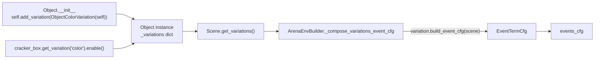

# Variation System — Plan

Companion to [2026_04_13_sensitivity_analysis.md](2026_04_13_sensitivity_analysis.md). First slice of the sensitivity-analysis feature: the *variation system* only. Analysis tooling is deferred.

## Goal

Build a variation system (samplers + variation base + registry) and validate it end-to-end with one concrete variation: `ObjectColorVariation` using a `UniformSampler` over RGB. No CLI, no eval_runner config, no other variations yet. Status: shipped — see [2026_04_21_color_variation_status.md](2026_04_21_color_variation_status.md).

## Design

Every `Object` subclass attaches the variations it supports in `__init__`, disabled by default. Users opt in via `get_variation(name).enable()` and optionally narrow the distribution with `set_sampler(...)`. The builder walks the scene, collects enabled variations, and merges their event terms into `events_cfg`.



Key separations:

- **Sampler**: stateless distribution (`Sampler` ABC + `UniformSampler`). RNG passed in at sample time.
- **Variation**: one knob. Owns a sampler, remembers its target asset *by name only* (see "gotchas"), emits an `EventTermCfg`.
- **Asset**: instantiates its supported variations in `__init__`, disabled. User flips them on.
- **Registry**: global `name → Variation class` table populated by `@register_variation`. Naming contract for later CLI resolution; not consumed by the builder yet.

## Module layout

- `isaaclab_arena/variations/__init__.py` — public re-exports; import triggers registrations.
- `isaaclab_arena/variations/sampler.py` — `Sampler` ABC + `UniformSampler`.
- `isaaclab_arena/variations/variation_base.py` — `VariationBase` ABC.
- `isaaclab_arena/variations/variation_registry.py` — `VariationRegistry` + `@register_variation`.
- `isaaclab_arena/variations/object_color.py` — `ObjectColorVariation` (first concrete variation).

## Core interfaces

```python
class Sampler(ABC):
    def sample(self, num_samples, generator=None) -> torch.Tensor: ...

class UniformSampler(Sampler):
    def __init__(self, low, high): ...  # scalar or broadcastable sequence

class VariationBase(ABC):
    name: ClassVar[str]
    def enable(self): ...
    def set_sampler(self, sampler: Sampler): ...
    @abstractmethod
    def build_event_cfg(self, scene: Scene) -> tuple[str, EventTermCfg]: ...

@register_variation
class ObjectColorVariation(VariationBase):
    name = "color"
    def __init__(self, asset: ObjectBase, mode="reset", mesh_name=""):
        self.asset_name = asset.name  # name only, no back-ref to the asset
```

Attached from the asset's `__init__`:

```python
class Object(ObjectBase):
    def __init__(self, ...):
        ...
        self.add_variation(ObjectColorVariation(self))  # disabled until .enable()
```

## Gotchas we hit

- **Don't back-reference the asset on the variation.** `configclass._validate` walks `obj.__dict__` recursively with no cycle check; `Object._variations["color"].asset → Object` creates an unbounded reference cycle that explodes validation with `RecursionError`. `VariationBase` stores nothing about the asset; concrete subclasses store the asset *name*.
- **`randomize_visual_color` RNGs collide.** Upstream seeds its `ReplicatorRNG` from the global seed with no per-term entropy, so two enabled colour variations emit byte-identical colour streams. `ObjectColorVariation` wires a local `_PerEventSeededRandomizeVisualColor` subclass that re-seeds the RNG from a hash of the (unique) `event_name`.
- **`scene.replicate_physics` must be `False`** for per-env material divergence. Newton preset flips it on; the example notebook asserts against it at compose time.

## Integration touchpoints

- `isaaclab_arena/assets/object_base.py` — `add_variation`, `get_variation`, `get_variations`, `_variations` dict.
- `isaaclab_arena/assets/object.py` — `self.add_variation(ObjectColorVariation(self))` in `__init__`.
- `isaaclab_arena/scene/scene.py` — `Scene.get_variations()` walks `ObjectBase` assets.
- `isaaclab_arena/environments/arena_env_builder.py` — `_compose_variations_event_cfg()` merges enabled variations into `events_cfg` (asserts unique event names).

## Example

```python
cracker_box = asset_registry.get_asset_by_name("cracker_box")()
cracker_box.get_variation("color").enable()
# optional: cracker_box.get_variation("color").set_sampler(
#     UniformSampler(low=(0.4,)*3, high=(1.0,)*3)
# )
scene = Scene(assets=[cracker_box, ...])
```

See `isaaclab_arena/examples/compile_env_notebook.py`.

## Open todos

- [ ] `isaaclab_arena/tests/test_variations.py` — sampler/registry unit tests + a ≥2-env sim integration test asserting per-env colour divergence.
- [ ] `ObjectMassVariation` — exercise the abstraction on a non-visual knob and a non-Replicator event path.
- [ ] `DiscreteChoiceSampler` — palette-style sampling; covers `randomize_visual_color`'s list-of-tuples path.
- [ ] Env-level variations escape hatch (scene-wide lights, HDR) — `IsaacLabArenaEnvironment.variations` + `add_variation` helper.
- [ ] CLI / Hydra plumbing for variation selection (`--variation cracker_box.color=uniform(...)`).

## Out of scope (this slice)

- Analysis tooling / sensitivity metrics.
- Per-env sampled-value logging for downstream analysis.
- Registration-time vs run-time orchestration (POC is per-reset runtime only).
- Semantic target indirection (`"pick_up_object"` → asset).
