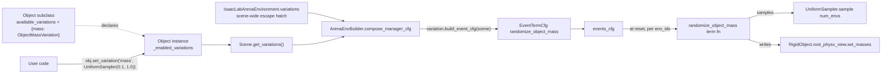

# Variation System — Mass POC Plan

Companion to [2026_04_13_sensitivity_analysis.md](2026_04_13_sensitivity_analysis.md). This plan covers the first slice of the sensitivity-analysis feature: the *variation system* only (analysis tooling is deferred).

## Goal

Build the skeleton of a variation system (samplers + variation base + registry) and validate it end-to-end with **one** concrete variation: `ObjectMassVariation` using a `UniformSampler` with hardcoded parameters. No CLI, no eval_runner config, no other variations.

## Design overview

Variations are declared by **asset classes** (analogous to how `ObjectBase` already declares event terms via `get_event_cfg()`). An asset class advertises which variations it *supports*; an asset instance holds the set of variations the user has *enabled* on it by supplying a sampler. The builder collects all enabled variations scene-wide and merges their event terms into `events_cfg`.



Key separations:

- **Sampler**: "how to draw values" (stateless distribution object). Seeded via an RNG passed in at sample time.
- **Variation**: "what knob to turn + how to turn it". Owns a sampler and an asset target; knows how to emit an `EventTermCfg`.
- **Asset class**: declares *supported* variations (class-level capability). Does **not** enable anything by default.
- **Asset instance**: holds *enabled* variations (user-configured sampler present). Default state = no variation (deterministic).
- **Registry**: global `name → Variation class` table. Not consumed by anything in this POC but establishes the naming contract for later CLI resolution.
- **Integration**: one new step in `ArenaEnvBuilder.compose_manager_cfg` collects `scene.get_variations() + arena_env.variations` and merges their event terms into `events_cfg`.

## New module layout

- `isaaclab_arena/variations/__init__.py` — re-exports; triggers registrations via imports.
- `isaaclab_arena/variations/sampler.py` — `Sampler` ABC + `UniformSampler`.
- `isaaclab_arena/variations/base.py` — `Variation` ABC + `VariationRegistry` + `@register_variation` decorator.
- `isaaclab_arena/variations/object_mass.py` — `ObjectMassVariation` + event term function `randomize_object_mass`.

## Core interfaces (sketch)

```python
class Sampler(abc.ABC):
    @abc.abstractmethod
    def sample(self, num_samples: int, generator: torch.Generator) -> torch.Tensor: ...

class UniformSampler(Sampler):
    def __init__(self, low: float, high: float): ...

class Variation(abc.ABC):
    @abc.abstractmethod
    def build_event_cfg(self, scene: Scene) -> dict[str, EventTermCfg]: ...

@register_variation("mass")
class ObjectMassVariation(Variation):
    def __init__(self, asset_name: str, sampler: Sampler): ...
    def build_event_cfg(self, scene): ...  # returns {"<asset>_mass_variation": EventTermCfg(...)}
```

`randomize_object_mass(env, env_ids, asset_cfg, sampler)`: mirrors Isaac Lab's `randomize_rigid_body_mass` shape but pulls values from our `Sampler` so the variation controls the RNG (see [isaaclab_arena/terms/events.py](isaaclab_arena/terms/events.py) for the existing per-env event pattern, e.g. `set_object_pose_per_env`). Writes masses via `rigid_object.root_physx_view.set_masses(...)`.

### Asset-declared variation support

On [isaaclab_arena/assets/object_base.py](isaaclab_arena/assets/object_base.py):

```python
class ObjectBase:
    @classmethod
    def available_variations(cls) -> dict[str, type[Variation]]:
        return {}  # subclasses extend

    def set_variation(self, name: str, sampler: Sampler) -> None:
        v_cls = type(self).available_variations()[name]  # KeyError if unsupported
        self._enabled_variations[name] = v_cls(asset_name=self.name, sampler=sampler)

    def get_variations(self) -> list[Variation]:
        return list(self._enabled_variations.values())
```

On [isaaclab_arena/assets/object.py](isaaclab_arena/assets/object.py) (rigid-body `Object`):

```python
class Object(ObjectBase):
    @classmethod
    def available_variations(cls):
        return {**super().available_variations(), "mass": ObjectMassVariation}
```

Every existing rigid object (e.g. `cracker_box`) picks up mass variation support for free. Articulated / non-rigid subclasses can extend the mapping with their own variations later (e.g. `joint_stiffness`).

`Scene.get_variations()` walks assets and concatenates their enabled variations.

## Integration touchpoints

- [isaaclab_arena/assets/object_base.py](isaaclab_arena/assets/object_base.py) — add `available_variations()`, `set_variation()`, `get_variations()`, and the `_enabled_variations` instance dict.
- [isaaclab_arena/assets/object.py](isaaclab_arena/assets/object.py) — extend `available_variations()` with `"mass": ObjectMassVariation` so every rigid object supports it.
- [isaaclab_arena/scene/scene.py](isaaclab_arena/scene/scene.py) — add `get_variations()` walking its assets.
- [isaaclab_arena/environments/isaaclab_arena_environment.py](isaaclab_arena/environments/isaaclab_arena_environment.py) — add an env-level `variations: list[Variation]` escape hatch (and a helper `add_variation`) for scene-wide variations that don't belong to any single asset.
- [isaaclab_arena/environments/arena_env_builder.py](isaaclab_arena/environments/arena_env_builder.py) — in `compose_manager_cfg`, after the existing event merges (`embodiment → scene → task → placement`), collect `scene.get_variations() + arena_env.variations` and merge each one's `build_event_cfg(scene)` into `events_cfg` using the same `combine_configclass_instances` pattern. Conflict policy for this POC: reject duplicate event term names with a clear assert.

## Example usage (driver script/test, no CLI yet)

```python
arena_env = KitchenPickAndPlaceEnvironment(args_cli).get_env(args_cli)

cracker_box = arena_env.scene.get_asset("cracker_box")
cracker_box.set_variation("mass", UniformSampler(0.1, 1.0))

env = ArenaEnvBuilder(arena_env, args_cli).make_registered()
```

## Tests

Add [isaaclab_arena/tests/test_variations.py](isaaclab_arena/tests/test_variations.py):

- **Unit** (no sim): `UniformSampler.sample(n)` returns shape `(n,)`, all values in `[low, high]`, reproducible under a fixed `torch.Generator` seed.
- **Unit** (no sim): `VariationRegistry` register/lookup round-trips; duplicate registration raises.
- **Unit** (no sim): `Object.available_variations()` includes `"mass"`; `set_variation("mass", sampler)` populates `get_variations()` with an `ObjectMassVariation`; `set_variation("nonexistent", ...)` raises.
- **Integration** (sim, mirrors [test_placement_events.py](isaaclab_arena/tests/test_placement_events.py) inner/outer pattern): build a minimal pick-and-place env, call `cracker_box.set_variation("mass", UniformSampler(0.1, 1.0))` *before* building, reset once, read back each env's cracker_box mass via the rigid object view, assert: (a) values lie in `[0.1, 1.0]`, (b) with `num_envs >= 2` and a fixed seed the values are not all identical.

## Todos

- [ ] **samplers** — Add `isaaclab_arena/variations/sampler.py` with `Sampler` ABC and `UniformSampler`.
- [ ] **base** — Add `isaaclab_arena/variations/base.py` with `Variation` ABC, `VariationRegistry`, and `@register_variation` decorator.
- [ ] **mass_variation** — Add `isaaclab_arena/variations/object_mass.py` with `ObjectMassVariation` and the `randomize_object_mass` event term function.
- [ ] **asset_support** — Add `available_variations()` / `set_variation()` / `get_variations()` to `ObjectBase` and wire `mass` into the rigid-body `Object` class; have `Scene.get_variations()` collect enabled variations from assets.
- [ ] **env_field** — Add env-level `variations` list + `add_variation` helper to `IsaacLabArenaEnvironment` as an escape hatch for scene-wide variations.
- [ ] **builder_hook** — Integrate variations into `ArenaEnvBuilder.compose_manager_cfg` by merging scene+env variation event terms into `events_cfg`.
- [ ] **package_init** — Wire `isaaclab_arena/variations/__init__.py` to re-export and trigger registrations.
- [ ] **tests** — Add `isaaclab_arena/tests/test_variations.py` with sampler unit tests, registry unit tests, an `Object.set_variation` unit test, and a sim integration test for the mass variation.

## Out of scope (explicit)

- CLI syntax (`--variation` flag, dotted-key parsing) — deferred.
- Other samplers (`Choose`, `Normal`) — only stub `Sampler` ABC so they slot in later.
- Other variations (pose, light, camera, HDR, object name) — deferred.
- Semantic target indirection ("pick_up_object" → asset) — use the concrete scene-entity name for now.
- Logging per-env sampled values for downstream sensitivity analysis — deferred.
- Registration-time vs run-time orchestration — this POC only handles per-env runtime variation.
