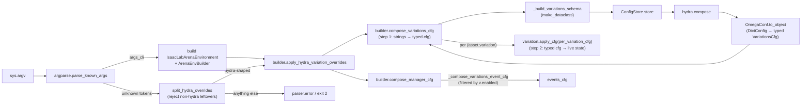

# Hydra Variation Configuration — POC Plan

Companion to [2026_04_13_sensitivity_analysis.md](2026_04_13_sensitivity_analysis.md), [2026_04_21_variation_system_plan.md](2026_04_21_variation_system_plan.md), and [2026_04_21_color_variation_status.md](2026_04_21_color_variation_status.md). Picks up the "Next" line at the bottom of the color-variation status doc.

## Goal

POC the CLI flow described in [2026_04_13_sensitivity_analysis.md](2026_04_13_sensitivity_analysis.md), scoped to `ObjectColorVariation` only:

1. `argparse` builds the env (non-Hydra flags pick assets/embodiment).
2. `ArenaEnvBuilder` walks the scene's variations and assembles a structured Hydra schema from their `*Cfg` classes.
3. Remaining `sys.argv` (the Hydra overrides) is composed against that schema.
4. The composed cfg is written back onto each variation, enabling it and updating its sampler / mode — driving the existing `ObjectColorVariation` plumbing already wired into `compose_manager_cfg`.

No new sampler types, no other variations, no eval-runner / experiment-file integration.

## Status

- [x] **`enabled` onto the variation cfg.** Moved from runtime `VariationBase._enabled` to `VariationBaseCfg.enabled` so a single source of truth covers both the imperative API (`variation.enable()`) and the Hydra-driven path. Imperative call sites unchanged. [isaaclab_arena/variations/variation_base.py](isaaclab_arena/variations/variation_base.py)
- [x] **`get_variations()` returns all.** `ObjectBase.get_variations()` / `Scene.get_variations()` now expose every attached variation (enabled or not); the `enabled` filter is applied locally in `ArenaEnvBuilder._compose_variations_event_cfg`. [isaaclab_arena/assets/object_base.py](isaaclab_arena/assets/object_base.py), [isaaclab_arena/scene/scene.py](isaaclab_arena/scene/scene.py), [isaaclab_arena/environments/arena_env_builder.py](isaaclab_arena/environments/arena_env_builder.py)
- [x] **Schema helpers on the builder.** `_iter_scene_variations()` collects `(asset_name, variation)` pairs from the scene; `_build_variations_schema(pairs)` builds a dynamic `VariationsCfg` dataclass using each variation's existing `*Cfg` directly as the per-variation node. [isaaclab_arena/environments/arena_env_builder.py](isaaclab_arena/environments/arena_env_builder.py)
- [x] **Public `get_variations_schema()`.** Thin wrapper that returns the dynamic class; `compile_env_notebook.py` prints the schema via `OmegaConf.to_yaml(OmegaConf.structured(...))` as an eyeball-before-Hydra-compose smoke test. [isaaclab_arena/examples/compile_env_notebook.py](isaaclab_arena/examples/compile_env_notebook.py)
- [x] **`compose_variations_cfg(hydra_overrides)` + `apply_hydra_variation_overrides(hydra_overrides)`.** Split into two steps after code review: compose builds the schema, registers it with `ConfigStore`, calls `hydra.compose`, and converts the result back into a typed `VariationsCfg` instance via `OmegaConf.to_object`; apply chains compose with a per-variation `variation.apply_cfg(per_variation_cfg)` write-back. `GlobalHydra.instance().clear()` is called on entry so both methods are re-entrant. [isaaclab_arena/environments/arena_env_builder.py](isaaclab_arena/environments/arena_env_builder.py)
- [x] **`VariationBase.apply_cfg(cfg)`.** Abstraction boundary that absorbs the per-variation field knowledge the builder used to hard-code (`sampler`, `mode`, `mesh_name`, ...). The base implementation does `self.cfg = cfg` and rebuilds the live sampler via `set_sampler(cfg.sampler)` when present; subclasses with extra derived state override and call `super().apply_cfg`. The builder's apply path is now field-name-free. [isaaclab_arena/variations/variation_base.py](isaaclab_arena/variations/variation_base.py)
- [x] **Notebook integration in `compile_env_notebook.py`.** Replaced the (sibling-notebook) plan: the existing `compile_env_notebook.py` now drives the two colour variations through `apply_hydra_variation_overrides([...])` with the imperative `enable() / set_sampler(...)` calls commented out (kept as a reference, not deleted) so the two paths sit side-by-side in one file. The schema is dumped before and after the apply call as a smoke test. [isaaclab_arena/examples/compile_env_notebook.py](isaaclab_arena/examples/compile_env_notebook.py)
- [x] **`@configclass` + Hydra sanity check.** Verified inside the Isaac Sim container by running `policy_runner.py` end-to-end with `cracker_box.color.{enabled,sampler.low,sampler.high}=...` overrides — `OmegaConf.to_object` round-trips the `@configclass`-decorated `VariationsCfg` (with nested `UniformSamplerCfg`) cleanly and the live `ObjectColorVariation` picks up the new sampler bounds without any fallback path being needed.
- [x] **CLI rollout to `policy_runner.py`.** Added `split_hydra_overrides(unknown, parser)` plus an optional `hydra_overrides` kwarg on `get_arena_builder_from_cli`, and switched the final `parse_args()` in `policy_runner.py` to `parse_known_args()` so positional `key.path=value` Hydra tokens after the env subcommand flow into the builder. Non-Hydra leftovers (typo'd `--flag`, stray positional) still hard-fail through `parser.error`, preserving the strict-argparse error semantics. Unit test in [isaaclab_arena/tests/test_split_hydra_overrides.py](isaaclab_arena/tests/test_split_hydra_overrides.py). [isaaclab_arena_environments/cli.py](isaaclab_arena_environments/cli.py), [isaaclab_arena/evaluation/policy_runner.py](isaaclab_arena/evaluation/policy_runner.py)

## Architecture



`apply_hydra_variation_overrides` is a thin chain of `compose_variations_cfg` (step 1) and a per-variation `variation.apply_cfg(...)` walk (step 2). The builder code on the apply side has no knowledge of variation-specific fields (`sampler`, `mode`, ...); the variation cfg dataclass *is* the enumeration of tunable parameters and `VariationBase.apply_cfg` is the abstraction boundary that maps a fully-composed cfg back onto its live variation.

## API shift: `enabled` moves onto the variation cfg

Originally the runtime `enabled` flag lived on the variation object (`VariationBase._enabled`), separate from its `cfg`. The Hydra-driven path requires a way to flip `enabled` from a CLI override, which is most natural if the flag lives on the cfg itself. We moved it: `VariationBaseCfg` gains `enabled: bool = False`, and `VariationBase.{enabled, enable, disable}` proxy through `self.cfg.enabled`. The imperative API is unchanged (`variation.enable()` still works); the schema gets simpler because every variation cfg already advertises `enabled` and we don't need to dynamically subclass to inject it.

## API shift: `get_variations()` returns all

Both `ObjectBase.get_variations()` and `Scene.get_variations()` used to silently filter to enabled variations. That made sense when the only consumer (`_compose_variations_event_cfg`) wanted exactly the enabled set, but it's the wrong default once Hydra needs to surface disabled knobs as `enabled=true` overrides.

We pushed the filter out of the scene/asset and into the builder:

- `ObjectBase.get_variations()` and `Scene.get_variations()` now return *every* attached variation regardless of `enabled`. The asset/scene becomes the inventory; the builder decides what to do with it.
- `ArenaEnvBuilder._compose_variations_event_cfg` keeps its existing behaviour via a one-line filter (`if not variation.enabled: continue`). It was the only consumer of `scene.get_variations()` in the repo at the time of the change.

This avoids a parallel `get_all_variations()` API.

## Landed module changes (steps 1–4)

### `isaaclab_arena/variations/variation_base.py`

- `VariationBaseCfg.enabled: bool = False` added.
- `VariationBase` drops `self._enabled`; `enabled` / `enable()` / `disable()` proxy through `self.cfg.enabled`.

### `isaaclab_arena/assets/object_base.py`

- `get_variations()` returns `list(self._variations.values())` (no `enabled` filter); docstring documents that callers must filter themselves.

### `isaaclab_arena/scene/scene.py`

- `Scene.get_variations()` walks every `ObjectBase` asset and returns all of its variations (no `v.enabled` filter); docstring mirrors `ObjectBase.get_variations`.

### `isaaclab_arena/environments/arena_env_builder.py`

- `_compose_variations_event_cfg`: adds `if not variation.enabled: continue` at the top of the loop; returns `None` only when the resulting fields list is empty.
- New `_iter_scene_variations() -> list[tuple[str, VariationBase]]`: walks `self.arena_env.scene.assets.values()`, filters to `ObjectBase`, yields `(asset.name, variation)` for each `asset.get_variations()` entry. The schema and apply paths both need the asset name; we don't read it off the variation because `asset_name` is an `ObjectColorVariation` implementation detail, not part of `VariationBase`.
- New `_build_variations_schema(pairs) -> type`: builds a dynamic dataclass mirroring [isaaclab_arena/examples/hydra_dynamic_schema_example.py](isaaclab_arena/examples/hydra_dynamic_schema_example.py).
  - Per `(asset_name, variation)`: the variation's existing `*Cfg` is used **as-is** as the schema node. `enabled: bool = False` lives on the shared `VariationBaseCfg` parent so every variation cfg already carries it — no dynamic subclassing required. Override paths line up one-to-one with cfg attribute paths (`cracker_box.color.enabled=true`, `cracker_box.color.sampler.low=[0.4,0.4,0.4]`). Default-factory captures `deepcopy(variation.cfg)` so each entry starts pre-populated from the live cfg.
  - Per asset: `make_dataclass("<AssetName>VariationsCfg", per_variation_fields)`.
  - Top-level: `make_dataclass("VariationsCfg", per_asset_fields)`.
- New `get_variations_schema() -> type | None`: thin public wrapper. Returns `None` when the scene has no variations attached.

### `isaaclab_arena/examples/compile_env_notebook.py`

Added a cell after `ArenaEnvBuilder` construction that prints the schema returned by `env_builder.get_variations_schema()`:

```python
from omegaconf import OmegaConf

variations_schema = env_builder.get_variations_schema()
if variations_schema is None:
    print("Scene has no variations attached.")
else:
    print(OmegaConf.to_yaml(OmegaConf.structured(variations_schema)))
```

Purpose: smoke test for the schema-building path before `hydra.compose` is wired. Confirms (a) the variation cfgs construct cleanly as dataclass nodes, (b) `OmegaConf.structured` accepts them, (c) the rendered YAML shape (`cracker_box.color.{enabled,mode,mesh_name,sampler.{low,high}}`) matches what we'll be overriding from the Hydra CLI in the next slice.

## Landed module changes (steps 5–6)

### `isaaclab_arena/variations/variation_base.py`

- New `VariationBase.apply_cfg(cfg)`: replaces `self.cfg` wholesale (so `enabled` and every variation-specific knob flips atomically) and rebuilds the live `Sampler` from `cfg.sampler` if the cfg carries one (via `set_sampler`). Subclasses that own additional derived state should override and `super().apply_cfg(cfg)` first. This is the abstraction boundary that keeps the builder field-name-free.

### `isaaclab_arena/environments/arena_env_builder.py`

Two-step split, motivated by code-review feedback that the first cut wired variation-specific field names (`sampler`, `mode`, `mesh_name`) into the generic builder:

- New `compose_variations_cfg(hydra_overrides) -> Any | None`. Builds the schema via `_build_variations_schema`, stores it in `ConfigStore`, calls `hydra.compose`, and converts the result back to a typed `VariationsCfg` instance via `OmegaConf.to_object`. `GlobalHydra.instance().clear()` is called on entry so the method is re-entrant (notebook cells, eval-runner loop). Returns `None` when the scene has no variations.
- Refactored `apply_hydra_variation_overrides(hydra_overrides) -> None`. Now a thin three-line chain: `composed = self.compose_variations_cfg(overrides)`, then a `for (asset_name, variation) in self._iter_scene_variations()` loop that calls `variation.apply_cfg(getattr(getattr(composed, asset_name), variation.name))`. No knowledge of any per-variation cfg field — adding a new variation with a different cfg shape doesn't touch this method.

```python
def apply_hydra_variation_overrides(self, hydra_overrides: list[str]) -> None:
    composed = self.compose_variations_cfg(hydra_overrides)
    if composed is None:
        return
    for asset_name, variation in self._iter_scene_variations():
        variation_cfg = getattr(getattr(composed, asset_name), variation.name)
        variation.apply_cfg(variation_cfg)
```

### `isaaclab_arena/examples/compile_env_notebook.py`

The originally planned sibling notebook (`compile_env_hydra_notebook.py`) was folded into the existing `compile_env_notebook.py` so the imperative and Hydra-driven paths sit side-by-side in one file:

- The imperative `cracker_box_color.set_sampler(...) / .enable()` block is commented out (not deleted) for reference; the `UniformSampler` / `UniformSamplerCfg` import is kept around with `# noqa: F401` so uncommenting is a single edit.
- A new cell after the `ArenaEnvBuilder` construction defines a `hydra_variation_overrides` list mirroring the original imperative bounds (cracker box varies red, tomato soup can varies blue), calls `env_builder.apply_hydra_variation_overrides(...)`, and re-dumps the schema so the user can confirm the overrides landed on the live variation cfgs.
- The pre-existing schema-inspection cell now runs *before* the apply call (its comment was updated to reflect that the schema is in its constructor-default state at that point).

```python
hydra_variation_overrides = [
    "cracker_box.color.enabled=true",
    "cracker_box.color.sampler.low=[0.2,0.2,0.0]",
    "cracker_box.color.sampler.high=[1.0,1.0,0.0]",
    "tomato_soup_can.color.enabled=true",
    "tomato_soup_can.color.sampler.low=[0.0,0.2,0.2]",
    "tomato_soup_can.color.sampler.high=[0.0,1.0,1.0]",
]
env_builder.apply_hydra_variation_overrides(hydra_variation_overrides)
```

In-notebook hard-coded list rather than the originally planned `parse_known_args()` leftover argv, because the notebook drives the rest of the flow with `args_cli = get_isaaclab_arena_cli_parser().parse_args([])` — there are no CLI args to "left over". The hard-coded list is structurally identical to what an eval-runner / CLI script would forward (`["a.b.c=...", ...]`), so the same `apply_hydra_variation_overrides` signature drops straight into both call sites.

## Landed module changes (step 7): CLI wiring for `policy_runner.py`

Promotes the in-notebook hard-coded list to a real CLI surface so a user can run

```bash
/isaac-sim/python.sh isaaclab_arena/evaluation/policy_runner.py \
    --policy_type zero_action --num_steps 10 --num_envs 4 \
    kitchen_pick_and_place --object cracker_box --embodiment franka_ik \
    cracker_box.color.enabled=true \
    cracker_box.color.sampler.low=[0.2,0.2,0.2] \
    cracker_box.color.sampler.high=[1.0,1.0,1.0]
```

and have the trailing `key.path=value` tokens land on the live variation cfgs via `ArenaEnvBuilder.apply_hydra_variation_overrides` — without changing any of the per-environment files in [isaaclab_arena_environments/](isaaclab_arena_environments/).

### `isaaclab_arena_environments/cli.py`

- New `split_hydra_overrides(unknown: list[str], parser: argparse.ArgumentParser) -> list[str]`. Walks the leftover list returned by `parser.parse_known_args()`, keeps tokens matching the conservative Hydra-shape regex below, and routes anything else through `parser.error(...)` so the script exits with code 2 and the same usage/error format strict `parse_args()` would have produced for a typo'd `--flag` or unbound positional. This is the hard guarantee that switching to `parse_known_args` doesn't make the CLI any more permissive than it already was.

  ```python
  _HYDRA_KEY = r"[A-Za-z_][A-Za-z0-9_.]*"
  _HYDRA_OVERRIDE_RE = re.compile(
      rf"^(?:~{_HYDRA_KEY}(?:=.*)?|(?:\+{{1,2}})?{_HYDRA_KEY}=.*)$"
  )
  ```

  Accepted shapes: `key.path=value`, `+key=value` (force-add), `++key=value` (force-set), `~key` / `~key=value` (delete). The `=` is mandatory in every shape except the `~`-prefixed delete; this is what keeps bare positionals like `stray_token` from silently passing through.

- `get_arena_builder_from_cli(args_cli, hydra_overrides: list[str] | None = None) -> ArenaEnvBuilder`. New optional kwarg; when non-empty the builder is constructed and then immediately fed through `env_builder.apply_hydra_variation_overrides(hydra_overrides)` before being returned. Defaults to `None`, so every existing caller (eval_runner, imitation-learning scripts, tests) stays byte-identical.

### `isaaclab_arena/evaluation/policy_runner.py`

The final strict `args_cli = args_parser.parse_args()` (previously line 164) becomes:

```python
args_cli, unknown = args_parser.parse_known_args()
hydra_overrides = split_hydra_overrides(unknown, args_parser)
...
arena_builder = get_arena_builder_from_cli(args_cli, hydra_overrides=hydra_overrides)
```

The earlier `parse_known_args` calls in the same `main()` (which exist to peek at `--policy_type` before importing the policy class) are unchanged — they already silently drop unknowns and stay correct under the new flow.

### `isaaclab_arena/tests/test_split_hydra_overrides.py` (new)

Pure-Python unit test (no Isaac Sim dependency) covering both halves of the helper's contract:

- All accepted Hydra shapes (`a.b=c`, `+a.b=c`, `++a.b=c`, `~a.b`, `~a.b=c`) pass through unchanged and in order; empty input → empty output; empty RHS (`a.b=`) accepted.
- Parametrised rejection of `--object`, `--unknown_flag`, `stray_positional`, `1.0`, `key with space=value`, `=value_only`, `+just_plus`, and the empty token; each raises `SystemExit(2)` via `parser.error`.
- Mixed valid + invalid batch fails the whole call.
- Error message names the offending tokens (captured via pytest's `capsys`).

### Deferred (still on `get_arena_builder_from_cli`'s `hydra_overrides=None` default)

Every other entry point that builds an env via `get_arena_builder_from_cli` is unchanged in this slice and remains a one-spot diff to pick up later — the override-application lives inside the helper, so each script only needs the `parse_args() → parse_known_args() + split_hydra_overrides` swap:

- [isaaclab_arena/evaluation/eval_runner.py](isaaclab_arena/evaluation/eval_runner.py) and the eval-runner JSON job-config schema (new `variation_overrides: list[str]` field on `Job`).
- [isaaclab_arena/scripts/imitation_learning/record_demos.py](isaaclab_arena/scripts/imitation_learning/record_demos.py), [teleop.py](isaaclab_arena/scripts/imitation_learning/teleop.py), [replay_demos.py](isaaclab_arena/scripts/imitation_learning/replay_demos.py), [annotate_demos.py](isaaclab_arena/scripts/imitation_learning/annotate_demos.py), [generate_dataset.py](isaaclab_arena/scripts/imitation_learning/generate_dataset.py).

## Why this fits the existing surface

- `_compose_variations_event_cfg` now filters on `v.enabled` itself (one extra line). The events_cfg it produces is identical to today, just sourced from a wider `get_variations()` and filtered locally.
- `set_sampler(SamplerCfg)` already handles the cfg-sync branch `apply_cfg` needs, so the per-variation write-back stays a one-liner (see `VariationBase.set_sampler`).
- The schema construction is the same dynamic-`make_dataclass` pattern already validated in [isaaclab_arena/examples/hydra_dynamic_schema_example.py](isaaclab_arena/examples/hydra_dynamic_schema_example.py); the only delta is using the real `ObjectColorVariationCfg` instead of a toy dataclass.
- `VariationBase.apply_cfg` is the only place the variation write-back lives. The builder talks to variations via that single method, so adding `ObjectMassVariation` / `LightingVariation` / ... is a "ship a new `*Cfg` + concrete class" exercise — no edits to `ArenaEnvBuilder`.

## Open questions / risks

- **~~`@configclass` as a Hydra structured-config node.~~** Resolved: end-to-end `policy_runner.py` run with `cracker_box.color.{enabled,sampler.low,sampler.high}=...` overrides exercises `OmegaConf.to_object` round-tripping of the `@configclass`-decorated `VariationsCfg` (with nested `UniformSamplerCfg`) and the live `ObjectColorVariation` picks up the new sampler bounds. No fallback needed.
- **Single sampler type.** `ObjectColorVariationCfg.sampler` is typed as `UniformSamplerCfg`, so the schema forces uniform RGB — exactly the POC scope. Discrete palettes (`DiscreteChoiceSampler`) will need a tagged-union extension later; out of scope here.
- **~~Single `initialize` per process.~~** Addressed: `compose_variations_cfg` calls `GlobalHydra.instance().clear()` on entry before `hydra.initialize(...)`. Safe to call repeatedly across notebook cells / an eval-runner loop.

## Out of scope (this slice)

- New variations (mass, lighting, HDR), new sampler types.
- `eval_runner.py` wiring + JSON job-config schema extension — deferred to a follow-up PR; underlying plumbing in `get_arena_builder_from_cli` is ready.
- Imitation-learning scripts (`record_demos.py`, `teleop.py`, `replay_demos.py`, `annotate_demos.py`, `generate_dataset.py`) — deferred for the same reason; each is a one-spot diff once we want it.
- Experiment-config-file support.
- Validation that disabling all variations leaves the env identical to the no-Hydra notebook (worth doing during implementation, but not a deliverable).
