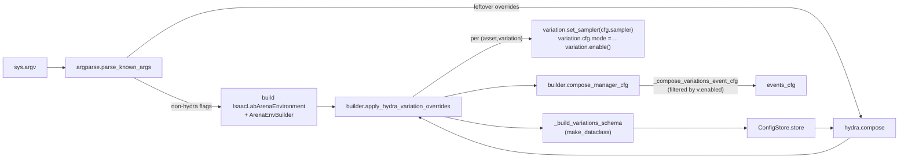

# Hydra Variation Configuration — POC Plan

Companion to [2026_04_13_sensitivity_analysis.md](2026_04_13_sensitivity_analysis.md), [2026_04_21_variation_system_plan.md](2026_04_21_variation_system_plan.md), and [2026_04_21_color_variation_status.md](2026_04_21_color_variation_status.md). Picks up the "Next" line at the bottom of the color-variation status doc.

## Goal

POC the CLI flow described in [2026_04_13_sensitivity_analysis.md](2026_04_13_sensitivity_analysis.md), scoped to `ObjectColorVariation` only:

1. `argparse` builds the env (non-Hydra flags pick assets/embodiment).
2. `ArenaEnvBuilder` walks the scene's variations and assembles a structured Hydra schema from their `*Cfg` classes.
3. Remaining `sys.argv` (the Hydra overrides) is composed against that schema.
4. The composed cfg is written back onto each variation, enabling it and updating its sampler / mode — driving the existing `ObjectColorVariation` plumbing already wired into `compose_manager_cfg`.

No new sampler types, no other variations, no eval-runner / experiment-file integration.

## Status

- [x] **`enabled` onto the variation cfg.** Moved from runtime `VariationBase._enabled` to `VariationBaseCfg.enabled` so a single source of truth covers both the imperative API (`variation.enable()`) and the Hydra-driven path. Imperative call sites unchanged. [isaaclab_arena/variations/variation_base.py](isaaclab_arena/variations/variation_base.py)
- [x] **`get_variations()` returns all.** `ObjectBase.get_variations()` / `Scene.get_variations()` now expose every attached variation (enabled or not); the `enabled` filter is applied locally in `ArenaEnvBuilder._compose_variations_event_cfg`. [isaaclab_arena/assets/object_base.py](isaaclab_arena/assets/object_base.py), [isaaclab_arena/scene/scene.py](isaaclab_arena/scene/scene.py), [isaaclab_arena/environments/arena_env_builder.py](isaaclab_arena/environments/arena_env_builder.py)
- [x] **Schema helpers on the builder.** `_iter_scene_variations()` collects `(asset_name, variation)` pairs from the scene; `_build_variations_schema(pairs)` builds a dynamic `VariationsCfg` dataclass using each variation's existing `*Cfg` directly as the per-variation node. [isaaclab_arena/environments/arena_env_builder.py](isaaclab_arena/environments/arena_env_builder.py)
- [x] **Public `get_variations_schema()`.** Thin wrapper that returns the dynamic class; `compile_env_notebook.py` prints the schema via `OmegaConf.to_yaml(OmegaConf.structured(...))` as an eyeball-before-Hydra-compose smoke test. [isaaclab_arena/examples/compile_env_notebook.py](isaaclab_arena/examples/compile_env_notebook.py)
- [ ] **`apply_hydra_variation_overrides(hydra_overrides)`.** Register the schema with `ConfigStore`, call `hydra.compose`, walk the result, and for every entry with `enabled=True` call `variation.set_sampler(cfg.sampler)` (+ propagate `mode` / `mesh_name`) and `variation.enable()`.
- [ ] **`isaaclab_arena/examples/compile_env_hydra_notebook.py`.** Sibling of `compile_env_notebook.py` driving the two color variations through `apply_hydra_variation_overrides(...)` instead of the imperative `enable() / set_sampler()` calls.
- [ ] **`@configclass` + Hydra sanity check.** Verify that `@configclass`-decorated `ObjectColorVariationCfg` works as a Hydra structured-config node end-to-end (`OmegaConf.structured` round-trip + list override of `sampler.low`). Local smoke test with stdlib `@dataclass` mocks passed; the real path needs to be run inside the Isaac Sim container.

## Architecture



## API shift: `enabled` moves onto the variation cfg

Originally the runtime `enabled` flag lived on the variation object (`VariationBase._enabled`), separate from its `cfg`. The Hydra-driven path requires a way to flip `enabled` from a CLI override, which is most natural if the flag lives on the cfg itself. We moved it: `VariationBaseCfg` gains `enabled: bool = False`, and `VariationBase.{enabled, enable, disable}` proxy through `self.cfg.enabled`. The imperative API is unchanged (`variation.enable()` still works); the schema gets simpler because every variation cfg already advertises `enabled` and we don't need to dynamically subclass to inject it.

## API shift: `get_variations()` returns all

Both `ObjectBase.get_variations()` and `Scene.get_variations()` used to silently filter to enabled variations. That made sense when the only consumer (`_compose_variations_event_cfg`) wanted exactly the enabled set, but it's the wrong default once Hydra needs to surface disabled knobs as `enabled=true` overrides.

We pushed the filter out of the scene/asset and into the builder:

- `ObjectBase.get_variations()` and `Scene.get_variations()` now return *every* attached variation regardless of `enabled`. The asset/scene becomes the inventory; the builder decides what to do with it.
- `ArenaEnvBuilder._compose_variations_event_cfg` keeps its existing behaviour via a one-line filter (`if not variation.enabled: continue`). It was the only consumer of `scene.get_variations()` in the repo at the time of the change.

This avoids a parallel `get_all_variations()` API.

## Landed module changes (steps 1–4)

### `isaaclab_arena/variations/variation_base.py`

- `VariationBaseCfg.enabled: bool = False` added.
- `VariationBase` drops `self._enabled`; `enabled` / `enable()` / `disable()` proxy through `self.cfg.enabled`.

### `isaaclab_arena/assets/object_base.py`

- `get_variations()` returns `list(self._variations.values())` (no `enabled` filter); docstring documents that callers must filter themselves.

### `isaaclab_arena/scene/scene.py`

- `Scene.get_variations()` walks every `ObjectBase` asset and returns all of its variations (no `v.enabled` filter); docstring mirrors `ObjectBase.get_variations`.

### `isaaclab_arena/environments/arena_env_builder.py`

- `_compose_variations_event_cfg`: adds `if not variation.enabled: continue` at the top of the loop; returns `None` only when the resulting fields list is empty.
- New `_iter_scene_variations() -> list[tuple[str, VariationBase]]`: walks `self.arena_env.scene.assets.values()`, filters to `ObjectBase`, yields `(asset.name, variation)` for each `asset.get_variations()` entry. The schema and apply paths both need the asset name; we don't read it off the variation because `asset_name` is an `ObjectColorVariation` implementation detail, not part of `VariationBase`.
- New `_build_variations_schema(pairs) -> type`: builds a dynamic dataclass mirroring [isaaclab_arena/examples/hydra_dynamic_schema_example.py](isaaclab_arena/examples/hydra_dynamic_schema_example.py).
  - Per `(asset_name, variation)`: the variation's existing `*Cfg` is used **as-is** as the schema node. `enabled: bool = False` lives on the shared `VariationBaseCfg` parent so every variation cfg already carries it — no dynamic subclassing required. Override paths line up one-to-one with cfg attribute paths (`cracker_box.color.enabled=true`, `cracker_box.color.sampler.low=[0.4,0.4,0.4]`). Default-factory captures `deepcopy(variation.cfg)` so each entry starts pre-populated from the live cfg.
  - Per asset: `make_dataclass("<AssetName>VariationsCfg", per_variation_fields)`.
  - Top-level: `make_dataclass("VariationsCfg", per_asset_fields)`.
- New `get_variations_schema() -> type | None`: thin public wrapper. Returns `None` when the scene has no variations attached.

### `isaaclab_arena/examples/compile_env_notebook.py`

Added a cell after `ArenaEnvBuilder` construction that prints the schema returned by `env_builder.get_variations_schema()`:

```python
from omegaconf import OmegaConf

variations_schema = env_builder.get_variations_schema()
if variations_schema is None:
    print("Scene has no variations attached.")
else:
    print(OmegaConf.to_yaml(OmegaConf.structured(variations_schema)))
```

Purpose: smoke test for the schema-building path before `hydra.compose` is wired. Confirms (a) the variation cfgs construct cleanly as dataclass nodes, (b) `OmegaConf.structured` accepts them, (c) the rendered YAML shape (`cracker_box.color.{enabled,mode,mesh_name,sampler.{low,high}}`) matches what we'll be overriding from the Hydra CLI in the next slice.

## Remaining work (steps 5–6)

### `ArenaEnvBuilder.apply_hydra_variation_overrides(hydra_overrides)`

Sketch:

```python
def apply_hydra_variation_overrides(self, hydra_overrides: list[str]) -> None:
    pairs = self._iter_scene_variations()
    if not pairs:
        return
    schema_cls = self._build_variations_schema(pairs)
    ConfigStore.instance().store(name="arena_variations_schema", node=schema_cls)
    with initialize(version_base=None, config_path=None):
        cfg = compose(config_name="arena_variations_schema", overrides=hydra_overrides)
    for asset_name, variation in pairs:
        node = getattr(getattr(cfg, asset_name), variation.name)
        if not node.enabled:
            continue
        variation.set_sampler(node.sampler)       # UniformSamplerCfg → live sampler + cfg sync
        for attr in ("mode", "mesh_name"):
            if hasattr(node, attr):
                setattr(variation.cfg, attr, getattr(node, attr))
        variation.enable()
```

Disabled entries are skipped, leaving the variation in its constructor-default (disabled) state — matching the imperative path in `compile_env_notebook.py`.

### `isaaclab_arena/examples/compile_env_hydra_notebook.py` (new)

Sibling of [isaaclab_arena/examples/compile_env_notebook.py](isaaclab_arena/examples/compile_env_notebook.py). Same scene (kitchen + `cracker_box` + `tomato_soup_can`) but the colour overrides come from Hydra:

- Parse non-Hydra flags with `get_isaaclab_arena_cli_parser().parse_known_args()`, keep the leftover for Hydra.
- Build assets / scene / `IsaacLabArenaEnvironment` exactly like the existing notebook, but **without** the explicit `.enable()` / `.set_sampler(...)` calls.
- Call `env_builder.apply_hydra_variation_overrides(hydra_overrides)`.
- Then `env_cfg = env_builder.compose_manager_cfg()` (unchanged path), `make_registered(env_cfg)`, run zero actions.

Demo CLI in the module docstring:

```bash
/isaac-sim/python.sh isaaclab_arena/examples/compile_env_hydra_notebook.py \
  --num_envs 4 --visualizer kit \
  cracker_box.color.enabled=true \
  cracker_box.color.sampler.low=[0.2,0.2,0.0] cracker_box.color.sampler.high=[1.0,1.0,0.0] \
  tomato_soup_can.color.enabled=true \
  tomato_soup_can.color.sampler.low=[0.0,0.2,0.2] tomato_soup_can.color.sampler.high=[0.0,1.0,1.0]
```

Mirrors the two colour overrides currently hard-coded in `compile_env_notebook.py` so the visual outcome is identical.

## Why this fits the existing surface

- `_compose_variations_event_cfg` now filters on `v.enabled` itself (one extra line). The events_cfg it produces is identical to today, just sourced from a wider `get_variations()` and filtered locally.
- `set_sampler(SamplerCfg)` already handles the cfg-sync branch we need, so the round-trip stays a one-liner (see `VariationBase.set_sampler`).
- The schema construction is the same dynamic-`make_dataclass` pattern already validated in [isaaclab_arena/examples/hydra_dynamic_schema_example.py](isaaclab_arena/examples/hydra_dynamic_schema_example.py); the only delta is using the real `ObjectColorVariationCfg` instead of a toy dataclass.

## Open questions / risks

- **`@configclass` as a Hydra structured-config node.** Hydra accepts any dataclass-like, and `isaaclab.utils.configclass` is dataclass-based; expected to "just work" but we should sanity-check during implementation that `OmegaConf.structured(ObjectColorVariationCfg())` succeeds and that overriding `sampler.low=[0.4,0.4,0.4]` round-trips a `list[float]` correctly. A stdlib `@dataclass` mock of the same shape passed locally; the real configclass path needs the Isaac Sim container.
- **Single sampler type.** `ObjectColorVariationCfg.sampler` is typed as `UniformSamplerCfg`, so the schema forces uniform RGB — exactly the POC scope. Discrete palettes (`DiscreteChoiceSampler`) will need a tagged-union extension later; out of scope here.
- **Single `initialize` per process.** Hydra's `initialize` raises if called twice with `config_path` overlap. For the POC the notebook calls `apply_hydra_variation_overrides` once, which is fine; we'll need a `GlobalHydra.instance().clear()` guard if/when this runs inside the `eval_runner` loop.

## Out of scope (this slice)

- New variations (mass, lighting, HDR), new sampler types.
- `policy_runner.py` / `eval_runner.py` wiring — kept to the example to keep the diff focused.
- Experiment-config-file support.
- Validation that disabling all variations leaves the env identical to the no-Hydra notebook (worth doing during implementation, but not a deliverable).
