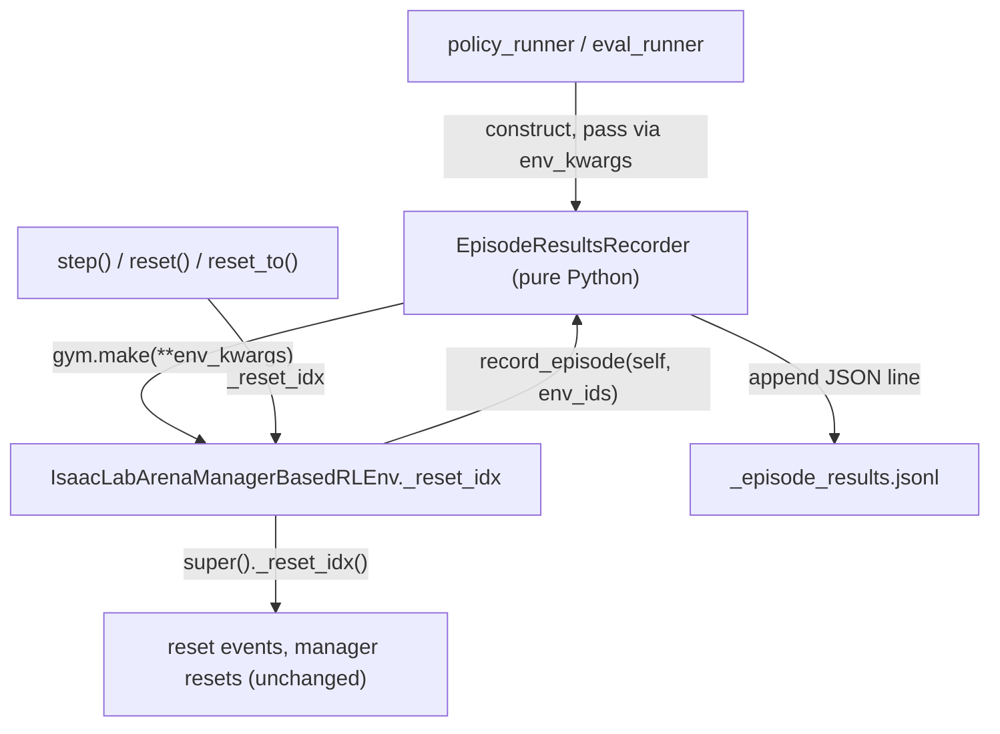

# Per-episode results recorder

## Overview

Add a pure-Python per-episode results recorder that captures core episode metadata (success, indices, seed, job/language) at the correct pre-reset instant by overriding the Arena env's `_reset_idx`, and writes one JSON line per episode to a JSONL file next to the HDF5 dataset.

## Design rationale

- The HDF5 recorder path is **tensor-only**: `RecorderManager.add_to_episodes` stores each term's returned value as a tensor into `EpisodeData` ([recorder_manager.py](submodules/IsaacLab/source/isaaclab/isaaclab/managers/recorder_manager.py) L308-344). So a `RecorderTerm` cannot record strings/arbitrary metadata. We use a **pure-Python recorder** instead that does its own extraction and JSONL writing. The existing `RecorderManager` keeps handling trajectories/metrics (tensors) unchanged.
- **Timing**: per-episode state (success, placement, runtime-variation samples, episode length) is cleared/overwritten by the auto-reset inside `step()`. It must be captured before the reset work runs.
- **Hook (override `_reset_idx`)**: the Arena env already subclasses `ManagerBasedRLEnv`; we override `_reset_idx` to capture at the top, then call `super()._reset_idx()`. This is self-contained, needs no metaprogramming, and covers every reset path. (See "Alternatives" for the `ArenaRecorderManager` in-place upgrade we considered instead.)

## Architecture



## Why the timing is correct

Verified against [manager_based_rl_env.py](submodules/IsaacLab/source/isaaclab/isaaclab/envs/manager_based_rl_env.py) L349-394: `ManagerBasedRLEnv._reset_idx` is a full reimplementation (it does **not** call `super()._reset_idx()`). In order it runs `curriculum_manager.compute` -> `scene.reset` -> `event_manager.apply(mode="reset")` (placement + runtime-variation re-sampling, L360-362) -> all manager resets including `termination_manager.reset()` (clears `success`, L387) and `recorder_manager.reset()` (L390) -> `episode_length_buf[env_ids] = 0` (L394).

Our override captures at the very top, before any of that, so `termination_manager.get_term("success")`, the variation samples, the current placement, and `episode_length_buf[env_id]` are all still the just-finished episode's values.

Coverage: every reset path routes through `_reset_idx` -- step auto-reset (L221), `reset()` ([manager_based_env.py](submodules/IsaacLab/source/isaaclab/isaaclab/envs/manager_based_env.py) L394), and `reset_to()` (L454). The initial `reset()` (all envs, nothing happened) is dropped by the recorder's first-reset skip.

## New module: `isaaclab_arena/evaluation/episode_results_recorder.py`

`EpisodeResultsRecorder` (plain Python, no Isaac Lab base class):
- Constructed with run/job metadata (`job_name`, `rebuild_idx`, `language_instruction`) and an output path. Opens the JSONL file in append mode. Tracks `self._first_reset = True`, `self._episode_counts: dict[int,int]`, and a running `global_episode_index`.
- Helper to resolve the path from an env cfg: `Path(cfg.recorders.dataset_export_dir_path) / f"{cfg.recorders.dataset_filename}_episode_results.jsonl"` (job-keyed + rank-unique because eval sets `dataset_filename=f"dataset_{job_name}"` and the builder appends timestamp/rank).
- `record_episode(env, env_ids)`: normalize `env_ids` (tensor/None -> list). Skip the very first call (initial reset, all envs, nothing happened), mirroring `SuccessRecorder` ([success_rate.py](isaaclab_arena/metrics/success_rate.py) L26-40). Otherwise, for each `env_id`: read success defensively (`"success" in env.termination_manager.active_terms` -> `get_term("success")[env_id].item()`, else `None`), increment the per-env counter and `global_episode_index`, build the core record, and write it as one JSON line (flush after each line for incremental durability).
- `close()`: close the file handle.

## Env change: `isaaclab_arena/environments/isaaclab_arena_manager_based_env.py`

The recorder is passed at construction via `env_kwargs`, mirroring the existing `variation_recorder` channel (the env does not reset during `__init__`, so there is no missed episode):

```python
def __init__(self, cfg, render_mode=None, variation_recorder=None, episode_results_recorder=None, **kwargs):
    self._episode_results_recorder = episode_results_recorder
    self._variation_recorder = variation_recorder
    super().__init__(cfg=cfg, render_mode=render_mode, **kwargs)

def _reset_idx(self, env_ids):
    # Capture BEFORE super() runs reset events (placement/variation) and resets the
    # termination/episode-length buffers, so the just-finished episode is still intact.
    if self._episode_results_recorder is not None:
        self._episode_results_recorder.record_episode(self, env_ids)
    super()._reset_idx(env_ids)
```

No change to `load_managers`, no setter, and no `ArenaRecorderManager`.

## Integration (no `rollout_policy` change needed)

Because writing happens inside `_reset_idx`, the runners only build the recorder from the composed cfg + job metadata, pass it through `env_kwargs`, and close it after. The recorder must be constructed after the cfg is composed (for the dataset path) but before `gym.make`.

- `eval_runner.load_env` ([eval_runner.py](isaaclab_arena/evaluation/eval_runner.py) L36-56): it already holds `env_cfg`/`env_kwargs` from `build_registered()` and sets `env_cfg.recorders.dataset_filename`. Extend it with the job metadata it needs (`rebuild_idx`, `language_instruction`) so it can construct `EpisodeResultsRecorder` (path from `env_cfg.recorders`) and add it to `env_kwargs` before `make_registered(env_cfg, env_kwargs, ...)`. Return the recorder (or keep a handle) so `main` can `close()` it in the cleanup path ([eval_runner.py](isaaclab_arena/evaluation/eval_runner.py) L335-341).
- `policy_runner.main` ([policy_runner.py](isaaclab_arena/evaluation/policy_runner.py) L197): split the one-shot `make_registered_and_return_cfg(...)` into `name, cfg, env_kwargs = arena_builder.build_registered()` -> construct `EpisodeResultsRecorder` (`job_name="policy_runner"`, `rebuild_idx=0`, `language_instruction=args_cli.language_instruction`, path from `cfg.recorders`) -> `env_kwargs["episode_results_recorder"] = rec` -> `arena_builder.make_registered(cfg, env_kwargs, render_mode=render_mode)`. Call `rec.close()` near `env.close()` (L267).

## v1 record schema (core only, as selected)

One JSON object per line: `{job_name, rebuild_idx, global_episode_index, episode_in_env, env_id, seed, success, language_instruction, task_description, timestamp}`. (`episode_length` is trivially available too, since `episode_length_buf` is intact at capture time -- include if useful.)

## Extensibility (future, not in v1)

`record_episode` is the single extension point and (being pure Python, before reset) can record arbitrary metadata: sampled variations incl. strings from `env.variation_recorder` ([variation_recorder.py](isaaclab_arena/variations/variation_recorder.py)); object-placer positions/orientations/loss by retaining the consumed `PlacementResult` per env in `solve_and_place_objects` ([placement_events.py](isaaclab_arena/relations/placement_events.py)); heterogeneous variant via `RigidObjectSet.variant_indices_by_env` ([object_set.py](isaaclab_arena/assets/object_set.py)); per-episode metric raw values via `compute_metrics()` recorded_data.

## Testing

- New `isaaclab_arena/tests/test_episode_results_recorder.py` using the inner/outer `run_simulation_app_function` pattern: build a small env via `ArenaEnvBuilder`, attach an `EpisodeResultsRecorder`, roll a few episodes, then assert the JSONL exists with one line per completed episode and correct `success`/index fields.
- Run via the `run-tests` skill (Phase 1 no-cameras is sufficient).

## Alternatives considered (not chosen)

The plan uses the `_reset_idx` override. The main alternative was an `ArenaRecorderManager`; others are weaker.

### A. In-place `ArenaRecorderManager` upgrade (the previous primary)

`ArenaRecorderManager(RecorderManager)` overrides `record_pre_reset` to call `super()` then the attached recorder. Because base `load_managers` hardcodes `self.recorder_manager = RecorderManager(self.cfg.recorders, self)` ([manager_based_env.py](submodules/IsaacLab/source/isaaclab/isaaclab/envs/manager_based_env.py) L336) -- and that constructor opens the HDF5 file -- the manager is installed by re-blessing the instance after `super().load_managers()`:

```python
self.recorder_manager.__class__ = ArenaRecorderManager   # rebind type, skip __init__
self.recorder_manager._episode_results_recorder = None    # set the one extra attribute
```

How it works: reassigning `obj.__class__` rebinds the instance to a subclass without calling `__init__`, keeping its existing `__dict__` (so `_terms`, `_episodes`, the open `_dataset_file_handler` survive) while redirecting method lookup, so the overridden `record_pre_reset` (and its `super()`) take effect; no second HDF5 handler is created. Safe because the subclass adds no `__slots__`/layout change and `isinstance(..., RecorderManager)` still holds.

Why not chosen: needs `__class__` metaprogramming and a separate manager class; couples to `RecorderManager` internals (comparable to coupling to `_reset_idx`) without being meaningfully cleaner.

### C. Reconstruct the manager in `load_managers`

`self.recorder_manager.close()` then `self.recorder_manager = ArenaRecorderManager(self.cfg.recorders, self)`. Risk: the base already opened the HDF5 file; closing may flush an empty dataset and there is a window with two handlers on the same path -> corruption/locking. Fragile and order-sensitive.

### D. Full override of `load_managers`

Copy the base body and swap the recorder line. Duplicates upstream submodule code (action/obs managers, startup events); brittle to upstream changes; highest maintenance.

### E. Composition / wrapper around `RecorderManager`

A delegating wrapper that forwards every method and adds the hook in `record_pre_reset`. Must faithfully forward a large, evolving surface (`record_pre_step`, `record_post_step`, `record_post_physics_decimation_step`, `record_post_reset`, `reset`, export/close, `add_to_episodes`, properties, `__str__`, `__del__`); easy to miss a method.

### F. Upstream factory seam

Add a `recorder_manager_class` attribute or `_make_recorder_manager()` to the base env and override it. Cleanest long-term, but requires modifying the IsaacLab submodule, which AGENTS.md flags as "ask first" (affects every contributor) and ideally needs upstreaming. Worth proposing separately.

### Rejected outright

- Reset-mode event term: runs inside `_reset_idx` *after* placement/variation re-sampling -> observes overwritten state (wrong timing).
- `RecorderTerm` returning `(None, None)` for side-effect capture: abuses the tensor-only recorder abstraction.
- Global monkeypatching of `RecorderManager.record_pre_reset`: global side effects across all envs.
