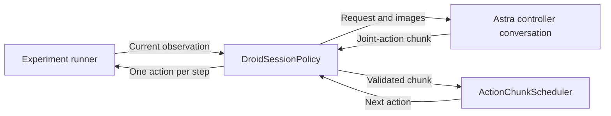

# Control Arena experiments from an Astra session

Status: implemented, 2026-09-17. This document records the agreed design, acceptance
checks, and validation results. See the
[example README](../../isaaclab_arena_examples/robot_tool_control/README.md) for usage.

## Objective and initial scope

Run the same Experiment Definition with OpenPI or an existing Astra session by changing
one command-line option. Reuse Arena's policy interface, action scheduling, environment
construction, task instructions, episode limits, metrics, and recording.

The downloaded `robolab_openpi_jobs_config.yaml` defines 38 Runs with 10 episodes each,
one environment, cameras, and trajectory recording. All referenced scenes use
`droid_abs_joint_pos`. The initial implementation targets that contract: DROID
joint-action chunks, one environment at a time.

Changing the policy must not silently change the embodiment, object placement, seeds,
task termination, camera configuration, or number of episodes. Compatibility is checked
explicitly; this does not make arbitrary robot/action configurations interchangeable.

## User workflow

The existing OpenPI command remains valid:

```bash
python isaaclab_arena/evaluation/experiment_runner.py \
  --experiment_config path/to/robolab_openpi_jobs_config.yaml
```

The Astra command adds one option:

```bash
python isaaclab_arena/evaluation/experiment_runner.py \
  --experiment_config path/to/robolab_openpi_jobs_config.yaml \
  --policy_config isaaclab_arena_examples/robot_tool_control/policy_configs/astra_droid.yaml
```

These commands run inside the ready Arena runtime. The experiment and policy files must
be visible there; a host Downloads path is not automatically mounted into Docker.

The policy configuration contains only the replacement policy's fields:

```yaml
type: isaaclab_arena.policy.droid_session_policy.DroidSessionPolicy
controller_prompt_path: isaaclab_arena_examples/robot_tool_control/prompts/astra_droid_joint_chunks.md
action_chunk_length: 15
response_timeout_s: 600.0
```

The path and timeout are the example defaults. Paths remain relative to the runtime working
directory, consistent with current Arena commands; do not introduce implicit search rules.
There is no host, port, model API key, or manually selected session directory.
The attached session determines the actual model. Selecting this configuration does not
launch or authenticate a model session.

For an agent-led run, give a fresh Astra agent the Experiment YAML path and
[`EXPERIMENT_PROMPT.md`](../../isaaclab_arena_examples/robot_tool_control/EXPERIMENT_PROMPT.md).
The agent discovers the existing runtime, launches the runner, and uses its agent tools
to create a controller without inherited history for each episode. The hosting session
must support fresh controller conversations; this is not a model-launching API in Arena.

OpenPI requires its server to be ready. The session policy requires a controller session
to consume requests. The runner prints the policy request directory so that the controller
can attach; it waits without advancing physics and fails explicitly if the timeout expires.

## Replace the policy through the existing loader

Add an optional policy configuration path to the public experiment loader and expose it as
`--policy_config` in the Experiment Runner. Resolve the selected policy with the existing
registry/dotted-class-path mechanism and validate its `PolicyCfg` through Hydra.

When the option is absent, preserve existing configuration behavior. When present:

1. Read the replacement mapping and require `type`.
2. Remove the original `shared.policy` and all original per-Run `policy` mappings.
3. Install the replacement as `shared.policy` before policy type resolution.
4. Apply the existing `shared.*` overrides, then merge each Run's remaining settings.
5. Compose the typed configuration and apply the existing `runs.<name>.*` overrides.

The operation replaces the complete policy, including policies explicitly declared in
individual Runs. It does not merge OpenPI fields into the session policy. Run names, order,
and count remain unchanged, including in mixed-policy experiments. CLI help and the existing
run summary must make that scope clear.

The downloaded experiment has no non-policy values interpolated from policy fields. That
independence is part of the one-option comparison contract: an experiment whose environment
or rollout settings depend on the old policy needs those dependencies resolved before claiming
equivalent settings. Preserve the raw non-policy values and inspect the resolved configuration;
do not promise invariance for arbitrary cross-policy interpolations.

Shared policy overrides address fields explicitly declared in the replacement file, following
today's shared-override restrictions. Per-Run overrides can adjust fields of the selected
policy. Per-Run policy-type switching is outside the initial scope. Reject the new option
for legacy JSON experiments rather than ignoring it. OSMO integration is a separate step.

Do not introduce model names into the runner or add another preset registry. Proper Hydra
policy groups may be useful later, but are unnecessary for this replacement mechanism.

## Component responsibilities

| Component | Responsibility and owned state |
| --- | --- |
| `experiment_runner.py` and `run_execution.py` | Load the effective experiment, construct environments/policies, assign output directories, execute Runs, and produce reports. |
| Existing `PolicyBase` | Keep `get_action`, `set_task_description`, `reset`, and `close` as the controller boundary. |
| `DroidSessionPolicy` | Validate the DROID contract, prepare observations, request chunks, track the active episode/request, and return one action per control step. It never calls `env.step()` or `env.reset()`. |
| Existing `ActionChunkScheduler` | Own the current action tensor and cursor; fetch a new chunk only when needed and discard buffered actions on reset. |
| File-exchange helper | Publish complete request/response files atomically, validate request identity, and wait with a bounded wall-clock timeout. |
| External controller session/driver | Read the controller prompt and current request, invoke Astra through the already-running session, submit a chunk, and create a fresh conversation for each new episode. |
| Existing recorders and metrics | Own task outcome, episode duration, trajectories, videos, and aggregate evaluation results. |



Use `ActionChunkScheduler` directly by composition, as the GR00T policy already does.
Do not refactor OpenPI's `RemoteChunkReplayPolicy` to add filesystem transport. With one
environment, configure the scheduler with `action_horizon = action_chunk_length = H`
and return exactly `(1, H, 8)` from its fetch callback. Its current buffer assignment expects
that exact horizon despite a more permissive callback docstring.

Reuse `Pi0DroidAdapter.extract()` and `pack_request()` to give the controller the same images
and numerical inputs as the current OpenPI policy. This uses the lightweight `openpi-client`
preprocessing dependency already included in Arena's default dependency groups; constructing
the adapter does not connect to an OpenPI server or load a model. Keep wire-format conversion
to relative image paths/JSON in the file-exchange helper. No new adapter hierarchy is needed.

Reuse the standalone demo's atomic-file publishing, request identity checks, and image
writing where applicable. Its old server owns a different environment and calls `env.step()`;
it must not run inside the new policy. Its observation function exposes additional state and
recomputes observations, so it is not the observation source for this comparison.

## Observation and action contract

Inputs per inference request:

- The current Run's language instruction, supplied through `set_task_description`.
- One external RGB image and one wrist RGB image, using OpenPI's 224-by-224 padded resize.
- Seven measured Panda joint positions and the normalized gripper position.
- Request/episode identity, control-step duration, and the declared action format.

Robot joint ordering, units, and joint limits are fixed interface information. No object
ground-truth positions, earlier-episode targets, extra camera views, end-effector poses,
or camera calibration enter the initial observation contract. Additional inputs later must
be explicit experiment settings and reported in comparisons.

Output is an `H`-by-8 numerical array. Each row contains seven absolute Panda joint angles
in radians followed by gripper `0` (open) or `1` (closed). Validate shape, finiteness, joint
ordering/ranges, and gripper values before consuming any row. Reject invalid responses;
do not silently clip, interpolate, solve IK, regenerate a response, or start another episode.
Record validation failures as controller errors, distinct from task failure.

Write and flush a policy-owned error artifact before raising a validation or timeout error.
The runner stops on the first execution error by default, so it may not reach aggregate
report generation. Preserve the request, raw response, error category, and message even when
no final Experiment result exists. Do not enable `--continue_on_error` implicitly.

The initial horizon is 15 control steps, matching the current `pi05` client. At Arena's
default 15 Hz this covers one simulated second. Read the actual `env.unwrapped.step_dt`
for the request; do not hardcode the control rate into the policy. New observations are
requested after the chunk, with no action revision inside it. A terminal step immediately
discards unused rows. The simulator does not step while waiting for the next response.

## Prompts and fresh conversations

The task instruction remains in the Experiment Definition's
`environment_builder.language_instruction`. The controller prompt explains image/state
interpretation, the action schema, the request/response commands, and episode restrictions.
It is a separate versioned Markdown file referenced by the policy configuration.

Snapshot the exact controller prompt contents, effective policy configuration, and their
hashes into the output directory before the first request. Include the task instruction
with each request. Keep the prompt fixed during an evaluation. The earlier
`CONTROLLER_PROMPT.md` starts the pose-command demo and cannot be reused unchanged.

The existing Astra conversation can serve one episode if its context meets the evaluation
restrictions. Clearing a Python action cache or writing a new episode ID cannot erase its
history. For multiple episodes, the external driver must create a fresh controller
conversation with the same fixed instructions and only that episode's observations.
Within an episode it retains feedback and can correct its next chunk.

The filesystem protocol can separate artifacts and reject old responses, but cannot prove
that a model context is fresh. Controller provenance must state how conversations were
created. No completed or interrupted attempt is replaced by a retry. The coordinating
agent following `EXPERIMENT_PROMPT.md` supplies episode handoffs using the hosting
session's fresh-agent capability. A standalone driver can also supply them; the policy
adapter alone does not create conversations.

## Output ownership and lifecycle

Add one optional, default-no-op method to `PolicyBase`:

```python
def set_output_directory(self, output_directory: Path) -> None:
    """Set the directory for artifacts produced by this policy."""
```

The Experiment Runner calls it once per policy instance with
`<experiment>/<run>/policy/rebuild<N>`. Existing policies keep their behavior. The session
policy creates an exclusive subdirectory named by its new instance UUID and prints that exact
path. Do not rely on timestamped output names being unique: the current runner uses seconds
and allows an existing timestamped directory. Keep its output semantics unchanged while
preventing old or concurrent exchanges from sharing the new policy's files. The controller
receives relative artifact paths under the instance directory, so host/container prefixes do
not leak into request files.

The initial supported entry point is the Experiment Runner, which already calls policy
cleanup in a `finally` block. The standalone Policy Runner currently lacks that guarantee
and does not call `PolicyBase.close()`. Supporting it requires both output-directory injection
and reliable policy cleanup; leave that work separate. The session policy fails clearly if
no output directory was assigned before its first action request.

The initial `policy.reset()` happens before `set_task_description()`. Therefore create the
episode manifest and first request lazily in `get_action()`, once the environment, instruction,
and output directory are available. Use Arena's `get_episode_index(env_id)` for episode IDs.

Maintain one outstanding request. Its identity includes protocol version, policy-instance ID,
environment ID, episode index, and request ID. Publish observations before atomically exposing
the request. The response echoes the identity and supplies the numerical action chunk. Accept
it once only; stale, duplicate, or mismatched responses cannot advance physics. Timeout closes
the request and stops the Run through the normal error path, without resubmission.

On `reset(env_ids)`, close an existing active episode exchange and emit an `episode_ended`
event, invalidate requests, and reset the scheduler. Do not open another conversation there:
the runner also calls reset after the final episode. The next `get_action()` begins the next
episode only if another one will actually run. An initial reset has no active episode to close.

`episode_ended` reports the boundary, not a success verdict. Arena's existing JSONL records
remain authoritative for success, duration, and seed. The controller driver may read those
after completion; the policy does not inspect private recorder fields or poll result files.
`close()` releases the exchange and marks an active, unfinished attempt as stopped. Do not
add a generic per-step callback solely for this integration.

Terminal images need pre-reset capture: the observation returned by the current environment
after a terminal step already belongs to the reset episode. Use the existing episode-recorder
extension point if adding terminal snapshots. The old demo's video changes consume final
observations when supplied; they do not make the current Isaac Lab checkout produce them.
Do not promise terminal-frame parity until the recorder path has been verified in this runtime.

## Implementation sequence and acceptance checks

1. Add the generic policy-file replacement to the loader and CLI. Check removal of all old
   policy fields, explicit per-Run replacement, override precedence, validation errors,
   mixed-policy behavior, and unchanged non-policy configuration. Existing commands retain
   their behavior.
2. Implement the session policy and small file-exchange helper using the existing scheduler
   and DROID adapter. Check chunk order/refetch, reset halfway through a chunk, initial/final
   lifecycle, wrong or late response IDs, invalid numeric actions, timeout, and cleanup.
   Keep test setup outside production APIs.
3. Add the controller prompt, submission/inspection client, and example policy file. Confirm
   that exported images and numerical state match OpenPI's adapter output and that paths
   work across the repository's Docker mount.
4. Run a one-episode RoboLab Rubik's-cube smoke experiment with a fresh controller conversation.
   Verify canonical results, saved configuration/prompt, action audit, and requested recordings.
   An unsuccessful task is still a valid smoke result if the integration behaves correctly;
   retain it and do not tune against that episode then call the rerun independent.
5. Verify two episodes with a driver that supplies distinct fresh conversations. Prove that
   old chunks/responses cannot cross the episode boundary before attempting the full suite.

Use the same committed reduced experiment for the first OpenPI/Astra comparison, changing
only `--policy_config`. The downloaded 38-Run file remains unchanged. Do not imply that setting
one episode selects one Run; a small experiment is needed for the initial smoke evaluation
because the current CLI has no named-Run selector.

Runtime checks run in the existing Arena container as required by repository guidance.
No OpenPI server, simulator, Docker configuration, submodule, or workflow changes are part of
the design phase. A general inference service, pose/IK control, multiple parallel controller
conversations, and managed OSMO execution are follow-up work.

## Accepted decisions

- Joint chunks are the first action contract. Keeping pose commands would require
  a different controller path and would not exercise the current OpenPI action interface.
- `--policy_config <file>` is the one-option switch. It intentionally replaces the
  policy for every Run; it is not a new Hydra group or a partial merge.
- The first runtime milestone uses one episode. Full independent evaluation depends on an
  external driver that creates fresh controller conversations, not on resets in Arena alone.

## Validation on 2026-09-17

- Passed 139 focused tests after integrating the existing pose-command demo, covering
  policy replacement, serialization into a fresh process,
  CLI parsing, session exchange, action validation/scheduling, runner cleanup, and the
  existing OpenPI policy. Recorder checks include terminal frames, resets, timing, and
  actual video encoding. The full simulation test suite was not run.
- Loaded the downloaded experiment with both policies: all 38 Runs retained their order
  and every resolved non-policy setting, including ten episodes per Run (380 total).
  This checks configuration equivalence; the 380-episode evaluation was not run.
- Completed the one-episode Rubik's-cube experiment with a fresh controller conversation.
  Arena recorded `success: true` at step 270, after 18 chunks of 15 direct joint actions.
  The controller used feedback within this episode and did not receive earlier attempts'
  observations or coordinates. This is one successful episode, not a success-rate estimate.
- Verified the canonical result, HTML report, episode record, trajectory recording, three
  camera videos, 18 matching request/response pairs, prompt/configuration hashes, and
  closed session without controller errors. The run is retained locally under
  `outputs/astra_policy_validation/run_zu6cn7hm`.
- Completed a separate two-episode lifecycle check with one fresh conversation per
  episode. Each controller held the measured joints; the task timeout was shortened to
  1.2 seconds for this check. Each 18-step episode requested chunks at steps 0 and 15,
  discarding the final 12 buffered rows on reset. An old episode's response was rejected
  while the next episode waited at step zero. Both episodes ended, no third episode was
  opened, and the session closed without errors. These intentionally unsuccessful task
  episodes are retained under `outputs/runtime_validation/astra_lifecycle_two_episodes`.

These checks used the existing Docker container with an isolated source snapshot of Arena's
pinned Isaac Lab revision, `bb0c8e1b9af381bf13064ec3303e17db79e4b6ef`. The local submodule
was already at a different revision, which causes CLI/import incompatibilities. The submodule
and container configuration were left unchanged; the temporary validation snapshot and
launcher are not part of the implementation.

The agent-led launch instructions were added after these runtime checks. Their shell
commands and episode handoffs were reviewed, but the complete launch prompt has not
been exercised on another person's installation.
