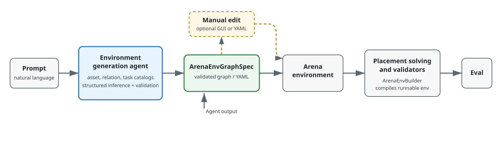

System Overview
===============

The agentic environment generation pipeline turns a prompt into a reusable
environment graph, compiles that graph into an Arena environment, and runs the
environment for evaluation.

   The generated graph spec is the boundary between generation and simulation.
   It can be saved, reviewed, and edited before an Arena environment is built.

Pipeline
--------

#. **Prompt.** The user describes the embodiment, scene, objects, spatial
   layout, and task in natural language.

#. **Environment generation agent.** ``EnvironmentGenerationAgent`` builds
   catalogs from Arena's live asset, relation, and task registries. It asks an
   OpenAI-compatible structured-output model to select catalog entries and
   produce a graph. Optional SimReady search can extend the asset catalog for
   objects not already registered in Arena. Object references receive a second
   inference pass to resolve their USD prim paths.

#. **Environment graph spec.** The agent returns a Pydantic-validated
   ``ArenaEnvGraphSpec``. This spec is the single source of truth for the
   embodiment, background, objects, object references, spatial relations,
   placement validators, and composite task. It can be serialized as YAML and
   reused without another model call.

#. **Optional manual edit.** A user can inspect and correct the generated YAML
   in the :doc:`GUI runner <gui_runner>` or in a text editor. Loading the YAML
   validates graph node IDs, relation endpoints, task parameters, and CLI
   overrides before compilation.

#. **Arena environment.** ``ArenaEnvGraphSpec.to_arena_env()`` resolves registry
   names and converts the declarative graph into Arena's scene, embodiment, and
   task objects. See :doc:`../concept_overview` for the Arena environment model.

#. **Placement solving and validation.** ``ArenaEnvBuilder`` solves the spatial
   relations, applies placement modifiers, runs placement validators, and
   compiles the result into a runnable Isaac Lab environment. See
   :doc:`../concept_object_placement` for the relation solver and
   :doc:`../concept_environment_compilation` for environment compilation.

#. **Evaluation.** A policy runner resets and steps the compiled environment,
   records task metrics, and reports evaluation results. The generation CLI
   uses a zero-action policy as a smoke test; downstream policy runners can use
   the same graph-spec YAML for full policy evaluation.

Agent boundary
--------------

The generation agent does not create an Isaac Sim environment directly. Its
output is the validated ``ArenaEnvGraphSpec``:

.. code-block:: text

   prompt + registry catalogs
       -> EnvironmentGenerationAgent.generate_spec(...)
       -> ArenaEnvGraphSpec

Keeping generation separate from simulation makes the model output reviewable
and lets the GUI, CLI, and evaluation tools share the same graph-spec format.
