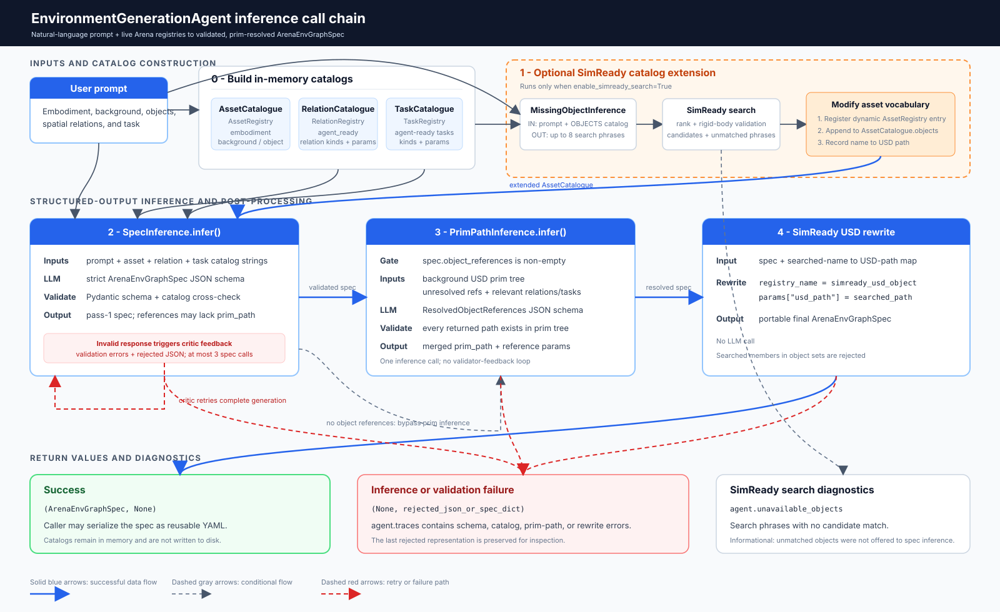

System Overview
===============

``EnvironmentGenerationAgent`` turns a natural-language task description and
Arena's live registries into a validated ``ArenaEnvGraphSpec``.

   The inference call chain, including catalog inputs, optional SimReady
   extension, validator-guided spec retries, prim-tree resolution, and return
   values.

Catalog inputs
--------------

At the start of each ``generate_spec()`` call, the agent uses caller-provided
catalogs or builds them from the live registries:

* ``AssetCatalogue`` contains registered embodiments, backgrounds, and
  objects from ``AssetRegistry``.
* ``RelationCatalogue`` contains relations marked ``agent_ready`` from  ``ObjectRelationLibraryRegistry``.
* ``TaskCatalogue`` contains tasks marked ``agent_ready`` from ``TaskRegistry``.

The catalogs are serialized into prompt text but are not written to disk.
Spec inference uses all three catalogs both as the model's vocabulary and to
validate its response. Prim-path inference does not use these catalogs; it
uses the selected background's USD prim tree.

Inference call chain
--------------------

#. **Optional missing-object and SimReady pass.** When SimReady search is
   enabled, ``MissingObjectInference`` receives the user prompt and the object
   portion of ``AssetCatalogue``. It returns search phrases for requested
   objects that are absent from the catalog. SimReady search returns matching
   USD candidates and unmatched phrases.

   Each matching candidate is registered dynamically in ``AssetRegistry`` and
   appended to ``AssetCatalogue.objects``. Therefore, SimReady search modifies
   the asset vocabulary consumed by spec inference; it does not modify the task
   or relation catalogs. The agent also records a mapping from each temporary
   registry name to its SimReady USD path.

#. **Spec inference and validator feedback.** ``SpecInference`` receives the
   prompt and the asset, relation, and task catalog strings. The model returns
   JSON under the strict ``ArenaEnvGraphSpec`` schema. The response is then
   checked by Pydantic and cross-validated against all three catalogs.

   If validation fails, the complete catalog prompt, rejected response, and
   validation errors are sent back as critic feedback. The model regenerates
   the complete spec, with at most three spec-inference calls. On success, the
   pass-one spec may still contain object references without ``prim_path``
   values.

#. **Conditional prim-tree resolution.** When the pass-one spec has
   ``object_references``, the agent loads the selected background USD's prim
   tree. ``PrimPathInference`` receives that tree together with unresolved
   references and the relevant relation and task context. It returns resolved
   references whose paths are checked against the prim tree and merged into a
   copy of the spec.

   This is one structured-output call rather than a validator-feedback loop.
   Specs without object references skip this stage.

#. **SimReady USD rewrite.** Finally, dynamically registered SimReady names are
   replaced with the portable ``simready_usd_object`` registry name, and the
   searched USD path is stored in ``params["usd_path"]``. This stage does not
   call the model.

The orchestration order in ``generate_spec()`` is:

.. code-block:: python

   asset_catalog = asset_catalog or build_asset_catalogue()
   relation_catalog = relation_catalog or build_relation_catalogue()
   task_catalog = task_catalog or build_task_catalogue()

   if self.enable_simready_search:
       asset_catalog = self._extend_catalogue_with_simready(prompt, asset_catalog)

   spec, data = self.spec_inference.infer(
       prompt,
       self._traces,
       asset_catalog=asset_catalog,
       relation_catalog=relation_catalog,
       task_catalog=task_catalog,
   )
   if spec is None:
       return None, data

   if spec.object_references:
       resolved = self.prim_path_inference.infer(spec, self._traces)
       if resolved is None:
           return None, spec.to_dict()
       spec = resolved

   unusable = self._add_simready_usd_path_to_searched_objects(spec)
   if unusable is not None:
       self._traces.append(unusable)
       return None, spec.to_dict()
   return spec, None

Outputs and agent boundary
--------------------------

On success, ``generate_spec()`` returns ``(ArenaEnvGraphSpec, None)``. The
caller can review the spec in the :doc:`GUI runner <gui_runner>` and serialize
it as YAML for reuse without another model call.

On failure, it returns ``(None, data)``, where ``data`` is the rejected model
JSON or unresolved spec dictionary. ``agent.traces`` contains validation,
prim-path, or SimReady rewrite errors. ``agent.unavailable_objects`` separately
reports SimReady search phrases for which no candidate was found.

Downstream, ``ArenaEnvGraphSpec.to_arena_env()`` resolves registry entries and
converts the declarative graph into Arena scene, embodiment, and task objects.
``ArenaEnvBuilder`` then runs the :doc:`relation solver
<../object_placement/solver>`, placement validation, and environment
compilation. See :doc:`../environment/env_builder` for that post-agent
pipeline.
