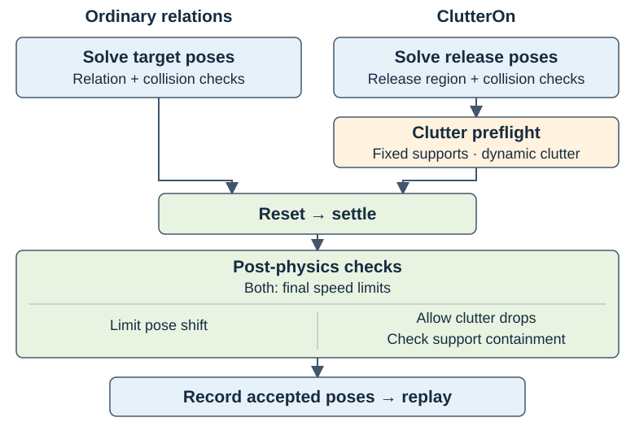

.. _record-and-replay-clutter-layouts:

Clutter Layouts
===============

Use ``ClutterOn`` to release objects above a fixed support, let physics settle
them, and save accepted layouts for later resets. The same
:doc:`recorder <recording>` handles ordinary placement relations and clutter.

How ClutterOn Recording Differs from Other Relations
----------------------------------------------------

Ordinary relations describe the intended arrangement before physics. The default
recording checks require objects to settle close to those solved poses.
``ClutterOn`` instead describes a release region: its objects are expected to
fall and rotate before reaching their resting poses.

Clutter recording adds a scene preflight for fixed supports, dynamic clutter
and gravity. Release layouts must pass ``no_overlap`` and
``clutter_on_relation``. After physics, ``pose_shift`` excludes clutter roots,
while ``support_containment`` checks their final footprint and minimum height.
Root velocity checks still apply to clutter and other recorded roots.

      acceptance and replay. Clutter adds scene preflight, release checks and
      support containment, and excludes intentional drops from pose-shift checks.

   Clutter uses the shared recording pipeline with different acceptance checks.
   Saved layouts pass the required solver checks and every applicable enabled
   post-physics check.

.. _tool-clutter-on-a-table:

Record One Table Layout
------------------------

Use an installed :ref:`Arena runtime <placement-recording-runtime>` and run the
commands from the repository root. These examples use PhysX on CPU. A viewer
requires a graphical display; for headless recording, replace
``render=true --viz kit`` with ``render=false --viz none``. Use a new output
path for each run; recordings are not overwritten.

The maintained scene releases three hammers and a clamp above an office table.
Record one accepted layout:

.. code-block:: bash

   python isaaclab_arena/scripts/record_placement_layouts.py \
       env_spec=isaaclab_arena_environments/clutter/franka_three_hammers_and_clamp_no_task.yaml \
       output=outputs/clutter/tools_on_table.jsonl \
       num_envs=1 min_layouts=1 layouts_per_env=1 max_batches=15 seed=42 \
       settle.num_steps=480 \
       +settle.validators.support_containment.minimum_resting_heights_m.office_table_background=0.5306 \
       presets=physx render=true --device cpu --viz kit

The table has sloped edges around its flat top. ``0.5306`` is its measured
surface height in the scaled table-local frame, in metres. ``office_table_background`` is the runtime
scene key, not the YAML node ID ``table``. A leading ``+`` adds this new key to
Hydra's configuration dictionary; existing fields such as ``settle.num_steps``
use plain ``=``.

The command attempts at most 15 reset-and-settle batches. It stops after one
layout passes the required solver checks and all applicable enabled
post-physics checks. The acceptance criteria are described under
:ref:`clutter-recording-checks`.

.. figure:: ../../../images/clutter/release.png
   :width: 640px
   :alt: Three hammers and a clamp suspended above the office table.

   An example solver layout before settling. Sampled positions vary by run.

.. figure:: ../../../images/clutter/settled.png
   :width: 640px
   :alt: The same hammers and clamp resting on the table after settling.

   The corresponding accepted layout after settling. Acceptance is determined
   by the recorded checks, not by the image alone.

.. _recording-and-replay-notes:

Check the Output
~~~~~~~~~~~~~~~~~

On success, ``outputs/clutter/tools_on_table.jsonl`` contains exactly one line.
The console reports progress and then a line of this form:

.. code-block:: text

   [recording] batch <batch>/15: 1/1 collected
   Saved 1/<attempted> accepted layouts: outputs/clutter/tools_on_table.jsonl

Every saved layout has passed the required solver checks and all applicable
enabled post-physics checks. The file stores the final root poses, validator
settings and outcomes. Replay restores these root poses; joint states and other
randomized properties still follow the environment's reset configuration.

Inspect the recorded root names and validation reports:

.. code-block:: bash

   python - <<'PYTHON'
   import json
   from pathlib import Path

   path = Path("outputs/clutter/tools_on_table.jsonl")
   records = [json.loads(line) for line in path.read_text().splitlines() if line.strip()]
   assert len(records) == 1, f"Expected one layout, got {len(records)}"
   placement = records[0]["variations"]["scene.relation_placement"]
   print("Source:", placement["source"])
   print("Roots:", sorted(placement["poses"]))
   print(json.dumps(placement["validation"], indent=2))
   PYTHON

``source``, ``poses``, and ``validation`` all belong to the
``scene.relation_placement`` variation. An enabled, applicable post-physics check
must have ``passed: true``. ``passed: null`` denotes a skipped check with a reason.

For larger targets, exhausting the batch budget can produce a **partial file**.
Every layout in that file has passed the same checks. With zero accepts,
**no file** is written. A shortfall is logged as an error and the command returns
normally. Compare the reported count with ``min_layouts`` to distinguish a
completed target from partial output. See :ref:`clutter-recording-troubleshooting`
if too few layouts are accepted.

Replay in the Viewer
~~~~~~~~~~~~~~~~~~~~~

Load the same scene and the file just recorded:

.. code-block:: bash

   python isaaclab_arena/scripts/environment_runner.py \
       --env_spec isaaclab_arena_environments/clutter/franka_three_hammers_and_clamp_no_task.yaml \
       --placement_layouts outputs/clutter/tools_on_table.jsonl \
       --num_envs 1 --device cpu --viz kit

The viewer starts with the recorded arrangement. These examples use ``NoTask``:
they load the first layout and do not trigger episode resets. Close the viewer
or press Ctrl-C to exit. Physics continues after reset. Keep the same backend,
asset geometry and joint-reset configuration when replaying the recording.

For policy evaluation, configure the same scene in an Experiment and pass this
file as its placement layouts. Follow the :ref:`evaluation replay instructions
<placement-recording-replay>` and :ref:`placement-replay-configuration`;
an experiment using a different scene's root names cannot replay this file.
The ``NoTask`` examples demonstrate placement, not task success.

Record a Batch
---------------

After the one-layout example works, request ten layouts across four environments.
This headless command writes a separate file:

.. code-block:: bash

   python isaaclab_arena/scripts/record_placement_layouts.py \
       env_spec=isaaclab_arena_environments/clutter/franka_three_hammers_and_clamp_no_task.yaml \
       output=outputs/clutter/tools_on_table_batch.jsonl \
       num_envs=4 min_layouts=10 layouts_per_env=4 max_batches=15 seed=42 \
       settle.num_steps=480 \
       +settle.validators.support_containment.minimum_resting_heights_m.office_table_background=0.5306 \
       presets=physx render=false --device cpu --viz none

Success means ten rows, with all accepted layouts passing their applicable
checks. A run may need more than ten attempts. Acceptance counts and poses can
vary across machines and backends even with the same seed. ``layouts_per_env``
controls solver pool refills, not the output count. See
:ref:`placement-recording-options` for defaults and the settling duration.

.. _cube-clutter-in-a-container:

Record Cube Clutter in a Bowl
------------------------------

The second maintained scene releases three cubes into a fixed YCB bowl:

.. code-block:: bash

   python isaaclab_arena/scripts/record_placement_layouts.py \
       env_spec=isaaclab_arena_environments/clutter/franka_three_cubes_in_bowl_no_task.yaml \
       output=outputs/clutter/three_cubes_in_bowl.jsonl \
       num_envs=1 min_layouts=1 layouts_per_env=1 max_batches=15 seed=42 \
       settle.num_steps=480 \
       +settle.validators.support_containment.minimum_resting_heights_m.bowl=-0.025 \
       presets=physx render=true --device cpu --viz kit

.. note::

   During bowl setup, PhysX may report ``kinematic bodies with CCD enabled are
   not supported! CCD will be ignored.`` The fixed bowl asset enables continuous
   collision detection (CCD), which PhysX ignores for that kinematic body. This
   message does not disable CCD on the falling cubes.

Here ``bowl`` is the support's runtime scene key. ``-0.025`` is a minimum
resting height in the scaled bowl-local frame, before adding its world position.
It permits settling below the rim. It is not a world-Z coordinate or the rim
height. For another container, measure its own interior floor instead of copying
this value. See :ref:`clutter-support-floor-height`.

The containment check uses the support's bounds and this height. It does not
prove exact containment within curved walls or exclude every possible
penetration. Inspect the contacts as well as the saved validation reports.

.. figure:: ../../../images/clutter/bowl_release.png
   :width: 640px
   :alt: Three cubes released above the rim of the YCB bowl.

   An example release layout above the bowl rim.

.. figure:: ../../../images/clutter/bowl_settled.png
   :width: 640px
   :alt: The same three cubes resting inside the bowl.

   The corresponding accepted layout after settling.

Success produces one row in ``outputs/clutter/three_cubes_in_bowl.jsonl``.
Inspect it with the earlier Python snippet, changing ``path`` to this bowl
recording, then open the viewer:

.. code-block:: bash

   python isaaclab_arena/scripts/environment_runner.py \
       --env_spec isaaclab_arena_environments/clutter/franka_three_cubes_in_bowl_no_task.yaml \
       --placement_layouts outputs/clutter/three_cubes_in_bowl.jsonl \
       --num_envs 1 --device cpu --viz kit

.. _clutter-adapt-environment:

Adapt Your Own Environment
---------------------------

Use the registration and factory path maintained by your environment package.
Register its assets, tasks, and embodiments before resolving them, and start
``SimulationApp`` before simulator-dependent imports. Build the complete
``IsaacLabArenaEnvironment`` description through that factory so its task,
physics callbacks, and runtime configuration are retained. Loading raw YAML is
not a substitute for a factory that also applies these settings.

The supplied scenes meet these requirements. When adapting another scene:

* Use fixed ``IsAnchor`` supports with static or kinematic collision geometry.
  Supports must be upright, with only quarter-turn rotations about world Z.
* Use dynamic rigid objects with gravity enabled for clutter. Each has one
  ``ClutterOn`` spatial relation to its support.
* Resolve non-clutter placement relations to fixed anchors before collection.
  Object sets and reachability requirements on clutter objects are unsupported.
* Keep recorded roots compatible with pose resets. Joint states and other
  randomized properties are not saved.

Use :ref:`ClutterOn settings <clutter-on-relation>` to choose release spread,
clearance and rotations. For containers or supports without a verified flat top,
provide a measured :ref:`support-local floor height <clutter-support-floor-height>`.

For example, the table scene fixes the table as an anchor and gives each tool
a ``ClutterOn`` relation with a smaller release region:

.. literalinclude:: ../../../../isaaclab_arena_environments/clutter/franka_three_hammers_and_clamp_no_task.yaml
   :language: yaml
   :start-at: relations:
   :end-before: task:

The following is a runnable built-in equivalent of passing a factory-built
description to the recorder. Save it as ``outputs/clutter/record_python.py``;
the output JSONL path must be unused:

.. code-block:: python

   import argparse

   from isaaclab.app import AppLauncher
   from isaaclab_arena.utils.isaaclab_utils.simulation_app import SimulationAppContext

   parser = argparse.ArgumentParser()
   AppLauncher.add_app_launcher_args(parser)
   args = parser.parse_args()

   with SimulationAppContext(args):
       from isaaclab_arena.environment_spec.arena_env_graph_spec import ArenaEnvGraphSpec
       from isaaclab_arena.offline_placement.recording_config import PlacementRecordingCfg
       from isaaclab_arena.scripts.record_placement_layouts import record_settled_placement_layouts

       source = "isaaclab_arena_environments/clutter/franka_three_hammers_and_clamp_no_task.yaml"
       arena_env = ArenaEnvGraphSpec.from_yaml(source).to_arena_env()
       # For your package, replace the preceding line with its configured factory call.
       cfg = PlacementRecordingCfg(
           output="outputs/clutter/tools_python.jsonl",
           num_envs=1, min_layouts=1, layouts_per_env=1, max_batches=15,
           presets="physx",
       )
       cfg.settle.num_steps = 480
       cfg.settle.validators["support_containment"] = {
           "minimum_resting_heights_m": {"office_table_background": 0.5306},
       }
       summary = record_settled_placement_layouts(cfg, device=args.device, arena_env=arena_env)
       print(summary.output, summary.accepted, summary.attempted, summary.rejections)
       assert summary.accepted == cfg.min_layouts, "Recording target not reached"

.. code-block:: bash

   python outputs/clutter/record_python.py --device cpu --viz none

The high-level API builds and closes the simulation environment. Supplying
``arena_env`` retains that description's callbacks and settings; ``cfg.presets``
is an explicit backend override. Omit it to keep your environment's preset.
Recording overrides placement sampling settings, including its seed and pool
refill size. Do not reuse those recording seed settings unchanged for replay.
See :ref:`placement-replay-configuration` for the required reset configuration.

If you already own a built environment, use the :ref:`caller-owned recording APIs
<placement-recording-python-api>` and pass the full
``arena_env.get_placement_assets()`` list. These APIs leave the environment open
at its final state. Use ``env.unwrapped`` when accessing Isaac Lab attributes
through a Gym wrapper. Preserve the same geometry, root names, joint resets,
and physics settings when replaying in your environment.

.. _clutter-recording-troubleshooting:

Troubleshoot Recording
----------------------

Scene setup errors name the unsupported asset or setting. Use
:ref:`clutter-recording-preflight` to fix support mobility, orientation,
release-region or replay-configuration problems before changing acceptance limits.

When too few layouts pass, inspect the printed :ref:`rejection summary
<recording_rejection_summary>`:

* ``physics_settled`` means a root exceeds the final speed limits. Inspect
  contacts and increase ``settle.num_steps`` if the scene needs more time to settle.
* ``support_containment`` means clutter failed a release check, the support moved,
  or final bounds extend beyond the footprint or below the minimum height. Check
  the support geometry and configured floor height.
* ``pose_shift`` identifies a non-clutter root that moved too far. Check whether
  clutter hit a fixture or robot; intentional clutter drops are excluded.

Increasing ``max_batches`` gives more attempts without relaxing the checks.
Acceptance counts can vary across machines and backends; a partial recording
still contains usable layouts that passed validation.
