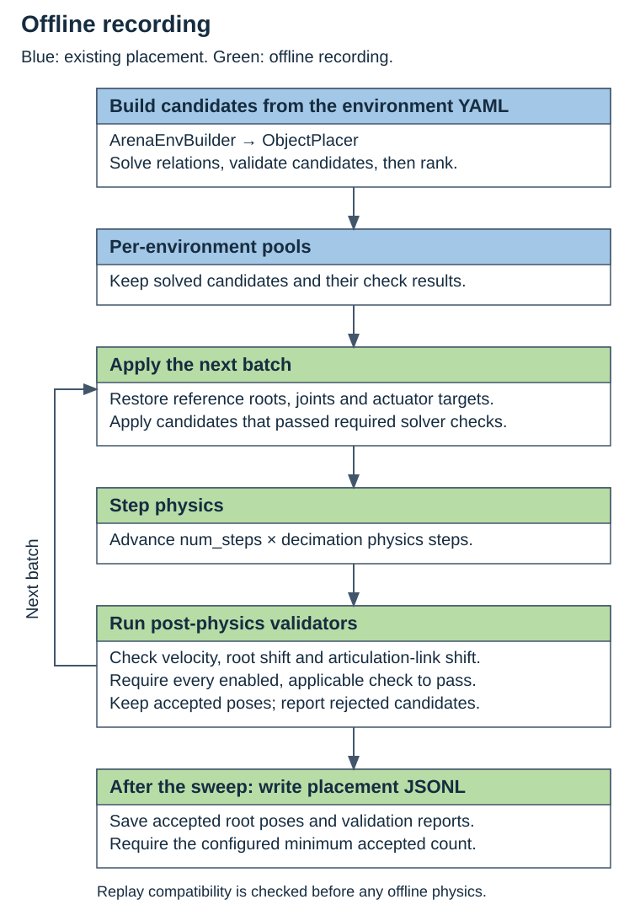
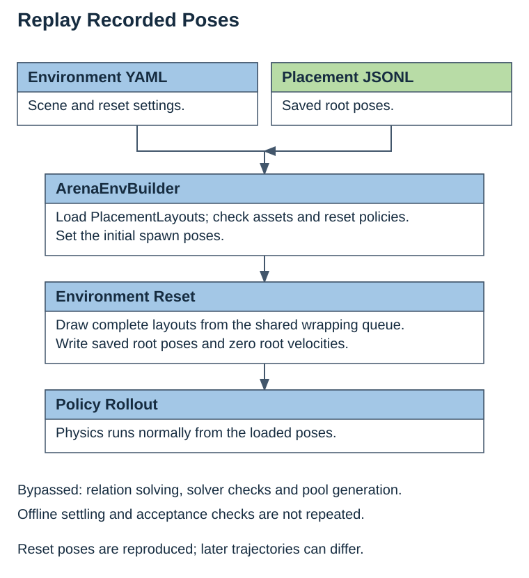

Recording Design and API
========================

Offline recording
-----------------

Recording extends the existing placement pipeline after pool construction. The
solver and required pre-physics checks produce candidate layouts. The recorder
applies each batch, advances physics once, and saves only candidates that pass
every enabled, applicable post-physics check.

Replay
------

Replay loads the recorded poses during environment construction. It bypasses
relation solving, candidate validation and pool generation. Resets select complete
layouts and write their poses with zero root velocity before policy execution.
Physics runs normally during the episode; replay does not repeat offline filtering.

Acceptance checks
-----------------

Each recorded candidate must pass all required solver checks and every enabled,
applicable post-physics validator. Candidates with missing explicitly required
solver results are rejected before simulation, including unavailable IK checks.
All validators share one physics pass. Disabled or inapplicable validators produce
skipped reports, not successful verdicts.
All rigid and articulation roots are recorded, including fixed rigid roots.

``settle.num_steps`` controls duration in environment steps (default 5), each
containing ``decimation`` physics substeps. The example uses 120 to give the scene
time to settle. ``settle.min_layouts`` sets the minimum accepted count needed to
write output (default 1).

The default validators are:

* ``physics_settled``: final linear and angular root-speed check, with ``lin_vel_thresh=0.1`` m/s
  and ``ang_vel_thresh=0.1`` rad/s.
* ``pose_shift``: maximum initial-to-final root displacement of ``max_translation_m=0.002`` metres
  and rotation of ``max_rotation_deg=2`` degrees from the initial pose.
* ``articulation_link_shift``: the same initial-to-final displacement and rotation
  limits for links relative to their root. Skipped when the scene has no articulations.

Settings live under ``settle.validators.<check>``. For example, append
``settle.validators.pose_shift.max_translation_m=0.001`` to tighten the root limit.
To disable a check explicitly, use
``settle.validators.pose_shift.enabled=false``. Its skipped report remains in the
record; that record no longer certifies the disabled condition. At least one
applicable validator must remain enabled. The walkthrough declares its
scene-specific translation limits explicitly.

With the default checks, a layout that comes to rest after a large drop is rejected.
``On`` defaults to 1 cm of release clearance, which exceeds the recording shift
limit. Choose a smaller source clearance when the arrangement must remain within 2 mm.
The walkthrough instead retains the existing Robolab scenes and declares a 15 mm
root limit to allow their authored release gap. The accepted final pose, including
a permitted adjustment, is what gets recorded. Joint
states are not saved, so excessive link motion also rejects the layout.

The solver's IK and geometric checks are not repeated after physics. The default
post-physics checks certify the velocity and shift limits above, not exact
preservation of every relation or a new IK solution at the measured poses.

.. _recording_robot_motion:

Robot motion and replay
-----------------------

Physics advances the entire scene using the actuator targets present after reset.
The robot is not held fixed: it may move or contact objects, affecting even an
accepted layout.

A fixed robot root can have zero speed while its joints move. Link-shift checks
compare the initial and final poses; they measure neither joint/link velocities
nor the largest displacement during settling. Passing these checks does not
establish that the articulation stayed still or stopped moving.

JSONL saves measured final root poses, including the robot root, but no joint
states. Replay uses the environment's joint-reset behavior. The Droid example
samples Gaussian joint offsets with a standard deviation of 0.02 radians and sets
matching actuator targets. Reusing that YAML does not guarantee the same joint
configuration. Matching robot contact geometry requires deterministic, matching
joint initialization; root-only replay does not reconstruct the complete
post-physics articulated state.

Python use and scope
--------------------

For an initialized environment with a placement pool:

.. code-block:: python

   from isaaclab_arena.offline_placement.recording_params import PlacementRecordingParams
   from isaaclab_arena.offline_placement.settled_placement import collect_settled_pool_layouts
   from isaaclab_arena.relations.placement_events import get_placement_pool

   result = collect_settled_pool_layouts(
       env, get_placement_pool(env), PlacementRecordingParams(num_steps=120),
       scene_assets=arena_env.get_placement_assets(),
   )
   result.layouts.write_episode_jsonl(
       "poses.jsonl", source="settled", validation=result.validation,
   )

Collection does not consume the pool or change its validation results.
``SceneSnapshot`` restores root poses and velocities, joint positions and velocities,
and actuator targets before each batch and on completion or failure. It does not
freeze the robot during physics or restore controller histories, validator
internals, task managers or all simulator state.

The recorder and ``run_placement_pool_validation.py`` share the same physics loop; a separate
validation run is unnecessary. Pool validation lives in
``isaaclab_arena.offline_placement.pool_validation``. The velocity-only pool
validator also supports deformables; root-pose recording does not.

Use concrete assets with writable rigid or articulation roots. Object sets and
``RandomAroundSolution`` are unsupported. Recording checks replay compatibility
before stepping physics: recorded assets must allow pose resets, have zero initial
velocity, and have no randomized or per-environment pose-reset policy. Replay
requires the same assets and robot joint reset configuration. Disable pose-changing
variations and callbacks when exact pose restoration is required. This tool records object and robot root
poses, not general variations or joint states.

Custom checks
-------------

Custom post-physics checks subclass ``PostPhysicsPlacementValidator`` in
``isaaclab_arena.offline_placement.post_physics_validation``. Define a dataclass with a unique
``check`` name and implement ``validate(PostPhysicsState)`` to return one
``PlacementValidatorReport`` per ``env_ids`` entry, in order. Use ``self.report``
to retain the effective settings. Enabled, applicable checks must return pass/fail;
``skip_reason`` describes scene-level inapplicability.

For an importable ``my_project.validators.SupportValidator`` with
``check = "support"``, add it to the existing checks with:

.. code-block:: bash

   +settle.validators.support._target_=my_project.validators.SupportValidator

The shared ``PlacementValidator`` base lives in ``relations.placement_validation``.
Existing solver validators keep their batch API; post-physics implementations
live under ``offline_placement``. The online placement path does not import the
offline package.
