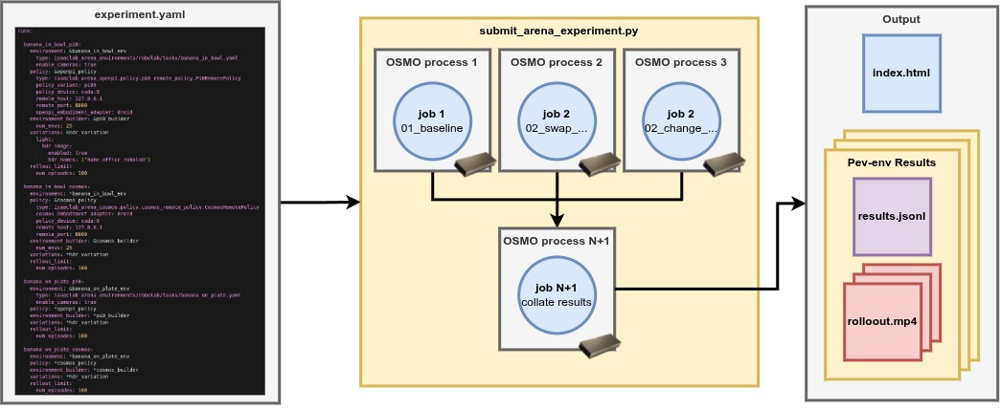

Multi-Node Evaluation
=====================

A thorough evaluation requires many rollouts.
For example, a moderately sized evaluation may have
**20 tasks, 2 policies, 100 episodes per task, for a total of 4000 rollouts.**
Running this on a single machine is possible, but could longer than a day.
We'd like answers more quickly.
Arena uses `OSMO <https://developer.nvidia.com/osmo>`_ to distribute execution across a cluster,
in order to reduce the time it takes to run the evaluations.

.. _osmo-setup:

Setting up OSMO
---------------

**Install the OSMO client:** Submitting an Experiment requires the OSMO command-line client, installed and authenticated
against your cluster. The `OSMO User Guide <https://nvidia.github.io/OSMO/main/user_guide/index.html>`_
covers this; follow its Getting Started pages in order:

- `System Requirements <https://nvidia.github.io/OSMO/main/user_guide/getting_started/system_requirements.html>`_ — check your environment is supported.
- `Install Client <https://nvidia.github.io/OSMO/main/user_guide/getting_started/install/index.html>`_ — install the ``osmo`` CLI.
- `Setup Profile <https://nvidia.github.io/OSMO/main/user_guide/getting_started/profile.html>`_ — point the client at your cluster.
- `Setup Credentials <https://nvidia.github.io/OSMO/main/user_guide/getting_started/credentials.html>`_ — authenticate with ``osmo login``.

Once ``osmo`` is installed and you can log in, you are ready to submit an Experiment.

**Set up a cluster:** The steps above assume you already have a cluster running OSMO. If you need to stand one up, see the
`OSMO Deployment Guide <https://nvidia.github.io/OSMO/main/deployment_guide/index.html>`_, which
covers deploying the OSMO service and connecting your own compute.

Specifying a multi-node Experiment
-----------------------------------

We use the same experiment files as for :doc:`single-node evaluations <../analysis/variations>` to specify multi-node evaluations.
Arena takes care of executing the evaluation described in an experiment file across a cluster.

   An Experiment YAML is submitted for multi-node execution. Arena schedules each Run as
   a parallel OSMO process, then collates per-env results into a shared output.

How Arena maps an Experiment onto the Cluster
---------------------------------------------

Arena takes a simple approach to scheduling experiments across a cluster.

- **Parallel execution of Runs.** Each ``run`` (an entry under the ``runs:`` key in the
  experiment YAML) specifies a simulation environment and a policy, and is scheduled
  independently. Given enough resources, Runs execute in parallel; otherwise they are queued
  until resources are available.
- **Policy servers.** Each ``run`` using a server-backed remote policy starts its own policy
  server and an experiment runner that uses it. For these ``run`` entries, executing everything
  in parallel requires ``2 × number of Runs`` GPUs.
- **One collected output.** A final task collects the per- ``run`` results and uploads them to
  an output bucket.

Submit an Experiment
--------------------

Submit an Experiment with ``osmo/submit_arena_experiment.py``. Point ``--experiment_cfg`` at an
Experiment YAML file. The command uses an experiment file included in the Arena repository.

.. code-block:: bash

   python osmo/submit_arena_experiment.py \
     --experiment_cfg isaaclab_arena_environments/robolab/experiment_configs/robolab_2_tasks_pi0_and_cosmos.yaml \
     osmo.pool=isaac-dev-l40-03 \
     osmo.platform=ovx-l40 \
     'osmo.output_url="swift://pdx.s8k.io/AUTH_team-isaac/isaaclab_arena/workflows/{{workflow_id}}"' \
     osmo.workflow_name=robolab_2tasks_pi_and_cosmos_100ep

This submits the two robolab tasks, each evaluated with both the
`pi0.5 <https://github.com/Physical-Intelligence/openpi>`_ and
`cosmos-action-edge <https://huggingface.co/nvidia/Cosmos3-Edge-Policy-DROID>`_ policies.
The policies are executed on
`L40 <https://www.nvidia.com/en-us/data-center/l40/>`_
nodes.

For these commands to work, you need a cluster running OSMO.
Replace ``osmo.pool=isaac-dev-l40-03`` with your cluster name,
``osmo.platform=ovx-l40`` with the model of available compute nodes,
and ``osmo.output_url`` with the Swift path where the results are published to (keep
``{{workflow_id}}`` for a unique path per submission).

The submission script outputs:

.. code-block:: text

  Workflow submit successful.
  Workflow ID        - robolab_2tasks_pi_and_cosmos_100ep-1
  Workflow Overview  - https://us-west-2-aws.osmo.nvidia.com/workflows/robolab_2tasks_pi_and_cosmos_100ep-1
  Workflow Dashboard - https://ovx-l40-03.osmo.nvidia.com/dashboard/#/search?namespace=osmo-prod&q=92795d52950048e8

In the OSMO dashboard, you can view the workflow and its runs:

.. figure:: ../../../images/teaser_page/multinode_evaluation/multinode_evaluation.png
   :width: 100%
   :alt: OSMO workflow view of a multi-node Arena experiment with parallel arena-run groups
   :align: center

   An OSMO workflow for a multi-node Arena Experiment. Each ``arena-run`` group runs an experiment
   runner and a policy server in parallel; a final collect task gathers the results.

Viewing the Results
-------------------

To view the results, we first need to download the results.

- use the GUI to navigate to the ``collect-experiment-outputs`` task
- click on the task to view its details
- click on the ``Logs`` button
- scroll to the bottom of the logs and you will see the path to the upload bucket
  e.g. ``Uploaded swift://pdx.s8k.io/AUTH_team-isaac/isaaclab_arena/workflows/robolab_2tasks_pi_and_cosmos_100ep-1``
- download the experiment data with

.. code-block:: bash

   osmo download swift://pdx.s8k.io/AUTH_team-isaac/isaaclab_arena/workflows/robolab_2tasks_pi_and_cosmos_100ep-1 <PATH_TO_DOWNLOAD_FOLDER>

To view the experiment results, double click on the ``index.html`` file in the downloaded folder.
This will open the results in your browser.

The results of the evaluation can also be plotted as a grouped success-rate bar chart. Point the
plotting script at the downloaded folder and list the policy suffixes present in the Run names:

.. code-block:: bash

   python -m isaaclab_arena.visualization.plot_success_rates \
     <PATH_TO_DOWNLOAD_FOLDER> \
     --policies pi0 cosmos \
     --output <PATH_TO_DOWNLOAD_FOLDER>/success_rates.png

The script reads every ``episode_results`` file below the folder and groups the bars by task,
where each task name is a Run name with its ``_pi0`` or ``_cosmos`` suffix removed. This produces
a plot like:

.. figure:: ../../../images/robolab_20tasks_pi_vs_cosmos_100ep.png
   :width: 100%
   :alt: OSMO workflow view of a multi-node Arena experiment with parallel arena-run groups
   :align: center

   The results of an evaluation of ``pi0.5`` and ``cosmos-action-edge`` policies on 20 robolab tasks.
   The experiment was run on a cluster of L40 nodes using the Arena
   experiment configuration file ``robolab_20_tasks_pi0_and_cosmos.yaml``.

*Note that the results are subject to multiple sources of randomness, so your results will not be exactly the same.*

Large-scale Sensitivity Analysis
--------------------------------

In :doc:`Sensitivity Analysis <../sensitivity_analysis/sensitivity_analysis>` we covered how to run sensitivity analysis on a single-node evaluation.
However, sensitivity analysis typically requires many rollouts to produce an accurate estimate, so it is a good candidate for multi-node execution.
Here we show how to run sensitivity analysis using multiple compute nodes.

To run ``pi0.5`` with the wrist camera extrinsics variations enabled run:

.. code-block:: bash

   python osmo/submit_arena_experiment.py \
     --experiment_cfg isaaclab_arena_environments/robolab/experiment_configs/robolab_20_tasks_pi0.yaml \
     osmo.pool=isaac-dev-l40-03 \
     osmo.platform=ovx-l40 \
     'osmo.output_url="swift://pdx.s8k.io/AUTH_team-isaac/isaaclab_arena/workflows/{{workflow_id}}"' \
     osmo.workflow_name=robolab_20tasks_pi_extrinsics \
     experiment_cfg.shared.variations.droid_abs_joint_pos.camera_extrinsics_wrist_camera.enabled=true

Note that you should replace ``isaac-dev-l40-03`` with your cluster name and ``ovx-l40`` with the model of available compute nodes.

Download the results as described above with a command of the form:

.. code-block:: bash

   osmo download swift://pdx.s8k.io/AUTH_team-isaac/isaaclab_arena/workflows/robolab_20tasks_pi_extrinsics-1 <PATH_TO_DOWNLOAD_FOLDER>

Where ``robolab_20tasks_pi_extrinsics-1`` is the workflow name assigned by OSMO during submission.

To analyze the results, for sensitivity to camera extrinsics variations, run:

.. code-block:: bash

   python -m isaaclab_arena.analysis.sensitivity.generate_report \
     --outcome success \
     --factors droid_abs_joint_pos.camera_extrinsics_wrist_camera \
     --output <PATH_TO_DOWNLOAD_FOLDER>/camera_extrinsics_sensitivity_report.png \
     --episode_results <PATH_TO_DOWNLOAD_FOLDER>/banana_in_bowl_pi0/episode_results_rebuild0.jsonl

Each Run writes its own ``episode_results_rebuild0.jsonl`` under
``<PATH_TO_DOWNLOAD_FOLDER>/<run_name>/``. Replace ``banana_in_bowl_pi0`` with the Run
you want to analyze.

For our experiment, the sensitivity analysis report looks like this:

.. figure:: ../../../images/multinode_sensitivty_results_pi0_100_episodes.png
   :width: 100%
   :alt: Sensitivity analysis report for camera extrinsics variations
   :align: center

   Sensitivity analysis report for camera extrinsics variations for the ``pi0.5`` policy on the ``banana_in_bowl`` task.

.. note::

  Running sensitivity analysis on multi-policy runs is not yet supported.
  We're working on supporting this in the future on ``main``.
  Reach out at `Isaac Lab Arena Issues <https://github.com/isaac-sim/IsaacLab-Arena/issues>`_ if you need this now.

Adjust the Experiment at submission time
----------------------------------------

You can tweak a Run at submission time, without editing its YAML file.
To view the available override-able values, use the ``--list_overrides`` flag.

.. code-block:: bash

   python osmo/submit_arena_experiment.py \
     --experiment_cfg isaaclab_arena_environments/robolab/experiment_configs/robolab_20_tasks_pi0_and_cosmos.yaml \
     --list_overrides

For example, to shorten the banana in bowl ``pi0.5`` run to four episodes:

.. code-block:: bash

   python osmo/submit_arena_experiment.py \
     --experiment_cfg isaaclab_arena_environments/robolab/experiment_configs/robolab_20_tasks_pi0_and_cosmos.yaml \
     experiment_cfg.runs.banana_in_bowl_pi0.rollout_limit.num_episodes=4

Of particular note is the ability to override the way the experiment is executed.
Overrides prefixed with ``osmo.`` set the workflow's scheduling and per-Run resources. The most
common ones are:

.. list-table::
   :header-rows: 1
   :widths: 30 20 50

   * - Override
     - Default
     - Meaning
   * - ``osmo.workflow_name``
     - ``arena-workflow``
     - Name the workflow appears under in OSMO.
   * - ``osmo.pool``
     - ``isaac-dev-l40s-04``
     - Target compute pool.
   * - ``osmo.platform``
     - ``ovx-l40s``
     - Hardware platform requested for each Run.
   * - ``osmo.gpus``
     - ``1``
     - GPUs requested per Run.
   * - ``osmo.cpus``
     - ``15``
     - CPU cores requested per Run.
   * - ``osmo.memory``
     - ``128Gi``
     - Memory requested per Run.
   * - ``osmo.storage``
     - ``200Gi``
     - Storage requested per Run.
   * - ``osmo.output_url``
     - ``swift://pdx.s8k.io/...``
     - Swift path for collected results.
       Use ``{{workflow_id}}`` for a unique path per workflow.

Preview before submitting
-------------------------

Add ``--dry_run`` to render the OSMO workflow YAML and print it instead of submitting it.

.. code-block:: bash

   python osmo/submit_arena_experiment.py \
     --experiment_cfg isaaclab_arena_environments/robolab/experiment_configs/robolab_20_tasks_pi0_and_cosmos.yaml \
     osmo.workflow_name=alex_arena_20tasks_pi_cosmos_robolab_100ep \
     --dry_run
