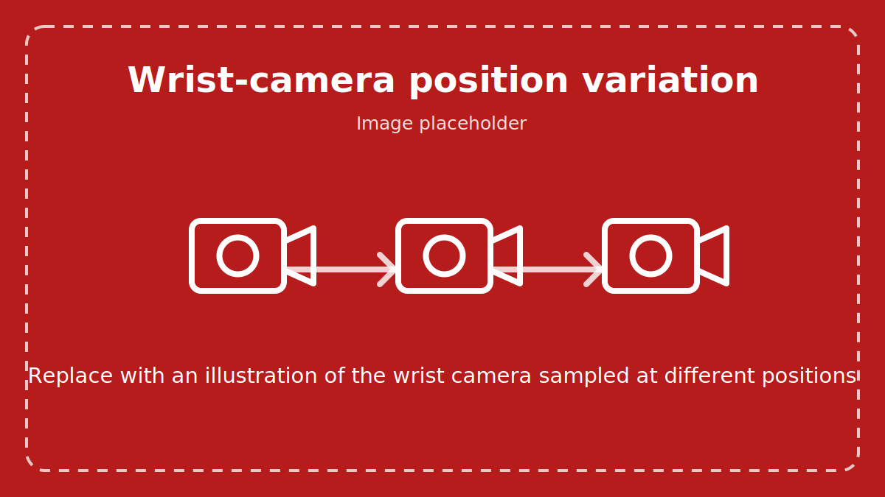

Variation System
================

A variation is a controlled change to one part of an environment. It lets you test the same
policy and task under different conditions without creating a separate environment for every
case.

Imagine testing a pick-and-place policy under dim, normal, and bright lighting. The robot,
objects, and task stay the same; only the light changes. That makes it easier to tell whether
lighting affected the result.

   Placeholder for a future illustration of wrist-camera position variation.

Why use variations?
-------------------

A policy can appear reliable when it is always tested in one familiar scene. Small changes in
lighting, camera placement, or object appearance may expose failures that a single fixed test
cannot show.

Variations help you:

* test a policy across a repeatable set of conditions;
* change one property without duplicating the full environment definition;
* record the exact condition used in every episode; and
* create the varied results needed for a sensitivity analysis.

Run the included example
------------------------

The repository includes a ready-to-run variation example. It uses the DROID robot for a
pick-and-place task and enables three variations:

* the background image;
* the light intensity; and
* the wrist-camera position.

The example uses a zero-action policy, so the robot remains still while you inspect the scene.
It rebuilds the environment five times, drawing a new background and light intensity for each
build. The wrist-camera position is drawn when the environment resets.

.. dropdown:: Configuration file (``droid_pnp_variations_config.json``)
   :animate: fade-in

   .. literalinclude:: ../../../../isaaclab_arena_environments/eval_jobs_configs/droid_pnp_variations_config.json
      :language: json

Start the Base Docker container from the repository root:

:docker_run_default:

Then run the example inside the container:

.. code-block:: bash

   python isaaclab_arena/evaluation/eval_runner.py \
     --viz kit \
     --eval_jobs_config isaaclab_arena_environments/eval_jobs_configs/droid_pnp_variations_config.json

The viewport will show the environment being rebuilt with different variation values:

.. figure:: ../../../images/droid_pnp_variations.gif
   :width: 100%
   :alt: DROID pick-and-place environment rebuilt with different backgrounds and light intensities
   :align: center

   The ``droid_pnp_variations_config.json`` example with variation changes shown at 5x playback
   speed. The wrist-camera position also changes, but that change is not visible from the
   external viewport.

Build-time and run-time variations
----------------------------------

.. todo::

   TODO(cvolk): Consider moving this detail to the Variations concept documentation and
   keeping only the explanation needed to understand the example workflow.

Some properties must be chosen before the environment is created. Others can change whenever
an episode resets. Arena calls these *build-time* and *run-time* variations.

.. list-table::
   :header-rows: 1
   :widths: 20 25 35 20

   * - Type
     - When it changes
     - Where the drawn value applies
     - Examples
   * - Build-time
     - Before the environment is built
     - Every parallel environment and episode in that build
     - Background image, light intensity
   * - Run-time
     - When an environment resets
     - One episode in one parallel environment
     - Wrist-camera position offset

This distinction matters when planning an evaluation. To collect several values of a
build-time variation, the environment must be rebuilt several times. A run-time variation can
produce a new value on each reset without rebuilding the scene.

Discovering available variations
--------------------------------

.. todo::

   TODO(cvolk): Consider replacing this section with a short link to the Variations concept
   documentation, where variation discovery and configuration are already covered.

The available variations depend on the assets and embodiment in the selected environment.
Use ``--list-variations`` with the policy or evaluation runner to see:

* which assets have variations;
* whether each variation is build-time or run-time;
* the setting used to enable it; and
* the fields that control its range or choices.

For the exact commands and configuration format, see :doc:`../../concepts/variations/variations`.
The :doc:`../../quickstart/first_experiments/exploring_variations` tutorial also shows how fixed
environment choices and parallel environments work in practice.

What Arena records
------------------

At the end of an episode, Arena writes the exact draw from every enabled variation alongside
the episode result. A record can look like this:

.. code-block:: json

   {
     "success": true,
     "variations": {
       "light.hdr_image": "home_office_robolab",
       "light.intensity": [1250.0],
       "droid_rel_joint_pos.camera_extrinsics_wrist_camera": [0.001, -0.002, 0.0]
     }
   }

This link between conditions and results is the foundation of
:doc:`sensitivity_analysis`. Without the recorded draws, a success rate can tell you whether
the policy struggled, but not which environment changes were present when it struggled.

The zero-action example on this page is intended to make the variations easy to see. In the
next section, you will run the same pick-and-place task with a policy and analyze how the
wrist-camera position is associated with success or failure.
