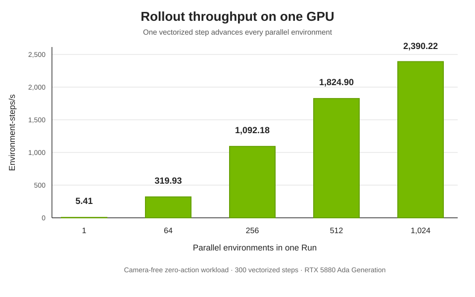
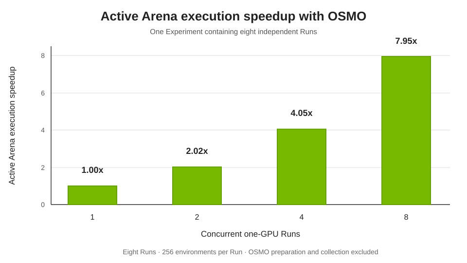

.. _performance-and-scaling:

Performance and scaling
=======================

Arena performance spans environment creation and evaluation execution. This page reports reference
measurements for three parts of that workflow:

* **Parallel environments within one Run:** advancing many environments together on one GPU to
  increase rollout throughput.
* **Independent Runs across GPUs:** using OSMO to execute Runs concurrently and reduce the time
  needed to finish an Experiment.
* **Agentic environment generation:** producing the first structured environment spec from a prompt,
  then resolving a valid spec into a pool of layouts.

An environment-step is one simulation step completed by one environment. A vectorized step
advances every parallel environment in a Run once. For example, one vectorized step with 256
parallel environments completes 256 environment-steps.

The two evaluation-execution benchmarks used the same camera-free workload: the DROID
Rubik's-cube-into-bowl task at the Maple table, the ``zero_action`` policy that sends zero-valued
actions, and 300 vectorized steps per Run. The agentic-generation benchmark uses the separate
workload described in its section.

.. note::

   These are preliminary reference measurements collected for this release. They show how the
   specified workloads performed on the named hardware and model; they are not performance
   guarantees for other tasks or systems.

.. _performance-parallel-environments:

Parallel environments within one Run
------------------------------------

The single-GPU benchmark ran a fresh Arena process for each environment count on one NVIDIA RTX
5880 Ada Generation GPU with 49,140 MiB of memory. Rollout throughput is the number of parallel
environments divided by the mean time for one vectorized step. It excludes process startup,
environment construction, report generation, and shutdown.

The host also used an Intel Core i9-10920X CPU with 12 cores and 24 threads, 62 GiB of system
memory, Ubuntu 22.04.5, and NVIDIA driver 560.35.05.

.. list-table:: Single-GPU rollout results
   :header-rows: 1
   :widths: 25 35 40

   * - Parallel environments
     - Mean vectorized step
     - Rollout throughput
   * - 1
     - 185.0 ms
     - 5.41 environment-steps/s
   * - 64
     - 200.0 ms
     - 319.93 environment-steps/s
   * - 256
     - 234.4 ms
     - 1,092.18 environment-steps/s
   * - 512
     - 280.6 ms
     - 1,824.90 environment-steps/s
   * - 1,024
     - 428.4 ms
     - 2,390.22 environment-steps/s

.. _performance-distributed-runs:

Independent Runs across GPUs with OSMO
--------------------------------------

The distributed benchmark used one Experiment containing eight identical Runs. Each Run created
256 parallel environments, advanced them for 300 steps, and used one NVIDIA L40 GPU. OSMO was
configured to execute at most 1, 2, 4, or 8 Runs at once.

With fewer than eight GPUs, OSMO executed the Runs in consecutive groups. The active Arena
execution time below is the sum of the active time for those groups, from the first Arena process
starting until the last process in each group exited. It includes Arena and Isaac Sim startup,
environment construction, rollout, and shutdown. It excludes OSMO queueing, container-image
downloads, inactive time between groups, and final output collection.

.. list-table:: OSMO distributed-Run results
   :header-rows: 1
   :widths: 20 27 23 15 15

   * - Concurrent Runs and GPUs
     - Scheduling of eight Runs
     - Active Arena execution time
     - Speedup
     - Mean Run duration
   * - 1
     - Eight consecutive Runs
     - 1,255.2 s
     - 1.00x
     - 156.9 s
   * - 2
     - Four groups of two
     - 621.0 s
     - 2.02x
     - 154.6 s
   * - 4
     - Two groups of four
     - 310.2 s
     - 4.05x
     - 154.3 s
   * - 8
     - All eight together
     - 157.8 s
     - 7.95x
     - 154.0 s

Executing all eight Runs at once reduced active Arena execution time from 20 minutes 55 seconds to
2 minutes 38 seconds, a 7.95x speedup. The mean duration of an individual Run changed by less than
2% across the four measurements. All 32 Runs completed successfully; the eight-GPU configuration
used six worker nodes.

Using both scaling axes
-----------------------

The two approaches address different parts of an evaluation and can be combined. Parallel
environments increase the amount of simulation work completed by each Run on its GPU. Distributing
independent Runs lets OSMO execute more of the Experiment at the same time across available GPUs
and worker nodes.

Rollout benchmark scope
-----------------------

* The single-GPU test ran on a local engineering workstation, not a controlled performance lab
  system.
* The workload did not render cameras or run policy inference. Cameras, policies, scene contents,
  and physics settings can change both throughput and capacity.
* The single-GPU and OSMO benchmarks used different GPU models and software builds. Their absolute
  step times should not be compared directly.
* Arena's component timers use CPU wall-clock time without explicit CUDA synchronization. They are
  rollout diagnostics, not GPU kernel measurements.
* Full OSMO submission time is not used for the distributed speedup because container-image cache
  state differed between submissions.

.. _performance-agentic-environment-generation:

Agentic environment generation
------------------------------

This benchmark measures the responsiveness and execution latency of Arena's agentic environment
generation pipeline. It answers two questions:

#. How long after a natural-language request does the agent return its first structured environment spec?
#. How long does Arena take to turn a valid environment spec into a resolved pool of Isaac Lab layouts?

Benchmark definition
^^^^^^^^^^^^^^^^^^^^

The benchmark reports wall-clock p50, p95, and p99 latency. Each environment and configuration was
measured 100 times.

**Time to first environment spec** is measured from the request being sent until the first parseable,
structured environment spec is available:

.. math::

   t_{\text{first spec}} = t_{\text{spec available}} - t_{\text{request sent}}

**Time from valid spec to resolved layouts** is measured from invoking the environment run command until
the layout pool and its object and robot placements are resolved and validated:

.. math::

   t_{\text{resolved layouts}} = t_{\text{layout pool ready}} - t_{\text{environment run command}}

A valid spec passes the fixed automated schema and semantic checks. SimulationApp startup is excluded from
layout-resolution latency.

The benchmark does **not** measure:

* Time to the first valid, repaired, or user-approved spec. The first-spec metric stops at the first parseable spec.
* Correctness, task fidelity, asset selection, semantic quality, or other model-dependent quality measures.
* Time spent reviewing or manually editing a generated spec, layout, task, asset choice, or placement.
* Human-assisted completion rate, review throughput, or time to a human-approved environment.

Benchmark coverage
^^^^^^^^^^^^^^^^^^

The environments vary scene complexity, object count, object source, and whether the objects are homogeneous
or heterogeneous. Layout resolution also varies the number of parallel environments. Each parallel environment
uses five cached layouts.

.. csv-table:: Agentic environment generation base environments
   :header: "Environment family", "Base request", "Variants"
   :widths: 24, 43, 33

   "Tabletop homogeneous pick and place", "DROID picks a banana to a plate on a maple tabletop.", "0, 6, or 14 fruit/vegetable distractors; SimReady beverage can and basket variant"
   "Tabletop heterogeneous pick and place", "DROID picks fruit to a plate on a tabletop.", "Heterogeneous fruit object set"
   "Kitchen homogeneous pick and place", "DROID picks a banana to a plate on a kitchen countertop. DROID is next to the countertop, on the floor.", "0, 6, or 14 fruit/vegetable distractors"
   "Kitchen open door", "DROID opens the fridge door in the kitchen. DROID is next to the fridge, on the floor.", "Referenced articulated fridge"

Factors expected to affect prompt-to-spec latency include the number of objects and relations, scene complexity,
SimReady Search API use, inference endpoint, and agentic model. Factors expected to affect layout resolution
include GPU, layout-pool size, the number of objects and relations, homogeneous versus heterogeneous geometry,
and scene complexity. See :ref:`agentic-env-gen-model-performance-effects` for how model and endpoint
selection affect generation latency and reliability.

Prompt to first environment spec
^^^^^^^^^^^^^^^^^^^^^^^^^^^^^^^^

The agentic model was ``openai/openai/gpt-5.6-terra`` on an internal endpoint. Requests used NVIDIA campus
Ethernet. Every environment returned a parseable first spec in all 100 trials.

.. figure:: ../../images/agentic_environment_generation/agentic_env_gen_first_spec_p50.png
   :width: 100%
   :align: center
   :alt: Median prompt-to-first-environment-spec latency for the benchmark environments.

   Median prompt-to-first-environment-spec latency. Hatching identifies the heterogeneous-object case.

.. csv-table:: Prompt-to-first-spec results
   :header: "Environment", "Scene", "Objects", "Heterogeneous", "Success", "p50 (s)", "p95 (s)", "p99 (s)"
   :widths: 32, 10, 8, 12, 9, 9, 9, 9

   "tabletop_banana_plate_distractors_0", "Tabletop", "2", "No", "100/100", "4.896", "10.020", "25.582"
   "tabletop_banana_plate_distractors_6", "Tabletop", "8", "No", "100/100", "7.010", "10.586", "15.180"
   "tabletop_banana_plate_distractors_14", "Tabletop", "16", "No", "100/100", "10.218", "14.985", "56.083"
   "tabletop_beverage_can_basket_simready", "Tabletop", "2", "No", "100/100", "9.927", "14.578", "26.546"
   "tabletop_heterogeneous_fruit_plate", "Tabletop", "2", "Yes", "100/100", "6.341", "10.693", "37.385"
   "kitchen_banana_plate_distractors_0", "Kitchen", "2", "No", "100/100", "12.704", "16.624", "27.293"
   "kitchen_banana_plate_distractors_6", "Kitchen", "8", "No", "100/100", "14.683", "20.607", "47.596"
   "kitchen_banana_plate_distractors_14", "Kitchen", "16", "No", "100/100", "18.105", "26.405", "74.618"
   "kitchen_open_fridge_door", "Kitchen", "0", "No", "100/100", "8.954", "18.527", "29.514"

Valid spec to resolved layouts
^^^^^^^^^^^^^^^^^^^^^^^^^^^^^^

Layout resolution ran on an NVIDIA RTX 6000 Ada. The layout count is five times the number of parallel
environments.

.. figure:: ../../images/agentic_environment_generation/agentic_env_gen_layout_resolution_p50.png
   :width: 100%
   :align: center
   :alt: Median valid-spec-to-resolved-layout-pool latency by scene and number of parallel environments.

   Median valid-spec-to-resolved-layout-pool latency as parallel environment count increases.

.. dropdown:: Detailed results
   :icon: table

   .. csv-table:: Valid-spec-to-resolved-layout results
      :header: "Environment", "Scene", "Objects", "Heterogeneous", "Envs", "Layouts", "p50 (s)", "p95 (s)", "p99 (s)"
      :widths: 31, 9, 7, 11, 6, 7, 8, 8, 8

      "tabletop_banana_plate_distractors_0", "Tabletop", "2", "No", "1", "5", "2.390", "3.192", "3.527"
      "tabletop_banana_plate_distractors_0", "Tabletop", "2", "No", "16", "80", "2.598", "2.957", "3.315"
      "tabletop_banana_plate_distractors_0", "Tabletop", "2", "No", "64", "320", "3.441", "4.025", "4.377"
      "tabletop_banana_plate_distractors_0", "Tabletop", "2", "No", "256", "1280", "7.065", "8.606", "8.918"
      "tabletop_banana_plate_distractors_6", "Tabletop", "8", "No", "1", "5", "5.882", "6.175", "6.270"
      "tabletop_banana_plate_distractors_6", "Tabletop", "8", "No", "16", "80", "6.609", "7.113", "7.558"
      "tabletop_banana_plate_distractors_6", "Tabletop", "8", "No", "64", "320", "11.217", "11.759", "13.844"
      "tabletop_banana_plate_distractors_6", "Tabletop", "8", "No", "256", "1280", "29.394", "31.400", "31.907"
      "tabletop_banana_plate_distractors_14", "Tabletop", "16", "No", "1", "5", "8.757", "10.257", "12.556"
      "tabletop_banana_plate_distractors_14", "Tabletop", "16", "No", "16", "80", "11.775", "13.197", "15.087"
      "tabletop_banana_plate_distractors_14", "Tabletop", "16", "No", "64", "320", "21.933", "23.591", "24.842"
      "tabletop_banana_plate_distractors_14", "Tabletop", "16", "No", "256", "1280", "62.691", "64.580", "65.778"
      "tabletop_heterogeneous_fruit_plate", "Tabletop", "2", "Yes", "1", "5", "3.234", "3.834", "4.157"
      "tabletop_heterogeneous_fruit_plate", "Tabletop", "2", "Yes", "16", "80", "3.376", "3.627", "3.779"
      "tabletop_heterogeneous_fruit_plate", "Tabletop", "2", "Yes", "64", "320", "4.186", "4.623", "5.235"
      "tabletop_heterogeneous_fruit_plate", "Tabletop", "2", "Yes", "256", "1280", "7.696", "8.076", "9.833"
      "kitchen_banana_plate_distractors_0", "Kitchen", "2", "No", "1", "5", "6.990", "7.639", "7.957"
      "kitchen_banana_plate_distractors_0", "Kitchen", "2", "No", "16", "80", "13.820", "14.357", "14.510"
      "kitchen_banana_plate_distractors_0", "Kitchen", "2", "No", "64", "320", "36.388", "37.213", "37.648"
      "kitchen_banana_plate_distractors_0", "Kitchen", "2", "No", "256", "1280", "136.645", "139.830", "142.016"
      "kitchen_banana_plate_distractors_6", "Kitchen", "8", "No", "1", "5", "12.148", "13.674", "17.569"
      "kitchen_banana_plate_distractors_6", "Kitchen", "8", "No", "16", "80", "23.967", "24.519", "24.774"
      "kitchen_banana_plate_distractors_6", "Kitchen", "8", "No", "64", "320", "68.159", "69.435", "70.180"
      "kitchen_banana_plate_distractors_6", "Kitchen", "8", "No", "256", "1280", "244.293", "248.615", "250.726"
      "kitchen_banana_plate_distractors_14", "Kitchen", "16", "No", "1", "5", "21.098", "22.358", "24.218"
      "kitchen_banana_plate_distractors_14", "Kitchen", "16", "No", "16", "80", "36.449", "37.629", "39.016"
      "kitchen_banana_plate_distractors_14", "Kitchen", "16", "No", "64", "320", "139.507", "142.345", "146.770"
      "kitchen_banana_plate_distractors_14", "Kitchen", "16", "No", "256", "1280", "649.275", "661.445", "679.157"
      "kitchen_open_fridge_door", "Kitchen", "0", "No", "1", "5", "3.234", "3.834", "4.157"
      "kitchen_open_fridge_door", "Kitchen", "0", "No", "16", "80", "3.376", "3.627", "3.779"
      "kitchen_open_fridge_door", "Kitchen", "0", "No", "64", "320", "4.186", "4.623", "5.235"
      "kitchen_open_fridge_door", "Kitchen", "0", "No", "256", "1280", "7.696", "8.075", "9.833"

Tested revisions
----------------

* **Agentic environment generation benchmark, September 4, 2026:** Arena `f641fe9df
  <https://github.com/isaac-sim/IsaacLab-Arena/commit/f641fe9dff9492623ebd8a799d07924801a78ec2>`_.

* **Single-GPU benchmark at 1, 64, and 256 environments, August 27, 2026:** Arena `b0cd0b38e
  <https://github.com/isaac-sim/IsaacLab-Arena/commit/b0cd0b38e660637ee5bc7f8c962994cb1cac4852>`_,
  Isaac Lab `af1bab4dc
  <https://github.com/isaac-sim/IsaacLab/commit/af1bab4dc173ba69b08fab779c14ead61d13fd33>`_, and
  the `camera-free benchmark configuration
  <https://github.com/isaac-sim/IsaacLab-Arena/blob/b0cd0b38e660637ee5bc7f8c962994cb1cac4852/isaaclab_arena_environments/experiment_configs/perflab/camera_free_benchmark_experiment.yaml>`_.
* **Single-GPU follow-up at 512 and 1,024 environments, September 9, 2026:** the same Arena and Isaac
  Lab revisions and camera-free workload.
* **OSMO benchmark, September 6, 2026:** Arena `4ee056866
  <https://github.com/isaac-sim/IsaacLab-Arena/commit/4ee056866b0f222fa166561ed46e2b5bace39445>`_,
  Isaac Lab `bb0c8e1b9
  <https://github.com/isaac-sim/IsaacLab/commit/bb0c8e1b9af381bf13064ec3303e17db79e4b6ef>`_, and
  the `OSMO benchmark configuration
  <https://github.com/isaac-sim/IsaacLab-Arena/blob/4ee056866b0f222fa166561ed46e2b5bace39445/isaaclab_arena_environments/experiment_configs/perflab/osmo/camera_free_scaling_validation_experiment.yaml>`_.
